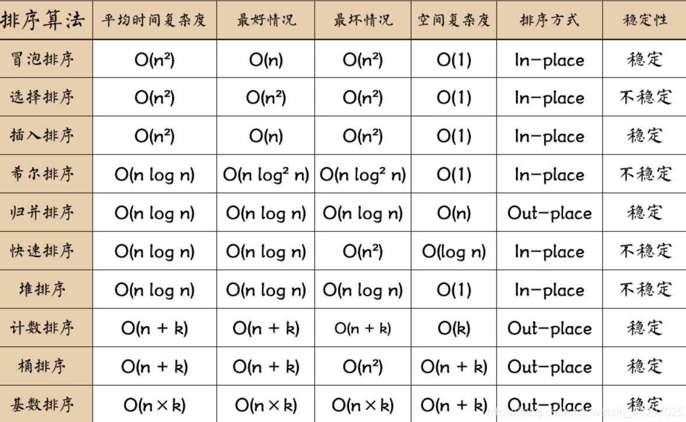

typora-copy-images-to: assets

# Leetcode笔记

### 基础

我们从算法所占用的「时间」和「空间」两个维度考察算法之间的优劣。

- 时间维度：是指执行当前算法所消耗的时间，我们通常用「时间复杂度」来描述。
- 空间维度：是指执行当前算法需要占用多少内存空间，我们通常用「空间复杂度」来描述。

我们通常使用「 **大O符号表示法** 」描述时间的复杂度，该符号又称为**渐进符号**。

用渐进符号可以将复杂度分为常数阶O(1)、线性阶O(n)、指数阶O(2^n)、对数阶O(logn)、线性对数阶O(nlogn)

排序算法时间复杂度、空间复杂度：




复杂度排名：


### 循环判断

**for**

**语法：**

```java
for (表达式1; 表达式2; 表达式3){
    //语句;
}
```

**执行过程：**

1. 求解表达式1。
2. 求解表达式2。若其值为真，则执行 for 语句中指定的内嵌语句，然后执行第3步；若表达式2值为假，则结束循环，转到第5步。
3. 求解表达式3。
4. 转回上面第2步继续执行。
5. 循环结束，执行 for 语句下面的语句。


**do while/while**

**语法：**

```java
while(条件是否为真) {
	//执行内容
}

do{
    //执行内容
}while(条件是否为真);
```

**注意点：**

* do while不管第一次条件是否为真，都会将执行内容执行一遍，直到执行完到判断语句再退出循环；
* while语句会先判断条件是否为真，如果有一次判断条件为假则不再执行下面的语句，退出循环。
* 如果第一次条件为真，则do while和while没有任何区别；


# 排序算法

**从时间复杂度上来看**
简单选择排序、直接插入排序和冒泡排序平均情况下的时间复杂度都为O（n^2），且实现过程也较为简单，但直接插入排序和冒泡排序最好情况下的时间复杂度的时间复杂度可以达到O(n)，而简单选择排序则与序列的初始状态无关。

希尔排序作为插入排序的拓展，对较大规模的排序都可以达到很高的效率，但目前未得出其精确的渐近时间。

堆排序利用了一种称为堆的数据结构，可在线性时间内完成建堆。且在O（nlog2n）内完成排序过程。

快速排序基于分治的思想，虽然最坏情况下快速排序时间会达到O(n ^ 2),但快速排序平均性能可以达到O（nlog2n），在实际应用中常常优于其他排序算法。

归并排序同样基于分治的思想，但由于其分割子序列与初始序列的排序无关，因此它的最好、最坏和平均时间复杂度均为O(nlog2n)。

**从空间复杂度来看**
简单选择排序、插入排序、冒泡排序、希尔排序和堆排序都仅需要借助常数个辅助空间。

快速排序在空间上只使用一个小的辅助栈，用于实现递归，平均情况下大小为O(log2n)，当然在最坏情况下可能会增长到O(n)。

2路归并排序在合并操作中需要借助较多的辅助空间用于元素复制，大小为O(n)，虽然有方法能克服这个缺点，但其代价是算法会很复杂而且时间复杂度会增加。

**从稳定性看**
插入排序、冒泡排序、归并排序和基数排序是稳定的排序方法，而简单选择排序、快速排序、希尔排序和堆排序都是不稳定的排序方法。


### 冒泡排序

冒泡排序是一种最基础的**交换排序**。之所以叫做冒泡排序，因为每一个元素都可以像小气泡一样，根据自身大小一点一点向数组的一侧移动。

**分析：**

冒泡排序的平均时间复杂度是 O(n^2)，空间复杂度为常数阶 O(1)，具体时间复杂度和数组的有序性也是有关联的，有顺序时时间复杂度最优可以达到 O(n)。逆序排列时最坏O(n^2)。

**原理：**

它重复地走访过要排序的元素列，依次比较两个相邻的元素，如果顺序（如从大到小、首字母从Z到A）错误就把他们交换过来，每次确定数组中的最大（小）项置于已排序数组的边缘位置。

**实现：**

1. 从当前元素起，向后依次比较每一对相邻元素，若逆序则交换 
2. 对所有元素均重复以上步骤，直至最后一个元素 

```java
public int[] bubbleSort(int[] nums) {
    int length = nums.length;
    for (int i = 0; i < length - 1; i++) {
        for (int j = 0; j < length - i - 1; j++) {
            if (nums[j] > nums[j + 1]) SortToolbox.swap(nums, j, j + 1);
        }
    }
    return nums;
}
```


### 插入排序

插入排序(InsertionSort)，一般也被称为直接插入排序。

对于少量元素的排序，它是一个有效的算法。插入排序是一种最简单的排序方法，它的基本思想是将一个记录插入到已经排好序的有序表中，从而一个新的、记录数增 1 的有序表。在其实现过程使用双层循环，外层循环对除了第一个元素之外的所有元素，内层循环对当前元素前面有序表进行待插入位置查找，并进行移动。

**分析：**

插入排序的平均时间复杂度是 O(n^2)，空间复杂度为常数阶 O(1)，具体时间复杂度和数组的有序性也是有关联的，有顺序时时间复杂度最优可以达到 O(n)。逆序排列时最坏O(n^2)。

**原理：**

假设前面 n-1(其中 n>=2)个数已经是排好顺序的，现将第 n 个数插到前面已经排好的序列中，然后找到合适自己的位置，使得插入第n个数的这个序列也是排好顺序的。

按照此法对所有元素进行插入，直到整个序列排为有序的过程，称为插入排序。

**实现：**

```java
public int[] insertSort(int[] arr){
    int length = arr.length;
    for (int i = 1; i < length; i++) {
        for(int j=i; j>0; j--){
            if(arr[j]<arr[j-1]){
                SortToolbox.swap(arr,j,j-1);
            }
        }
    }
    return arr;
}
```


### 选择排序

选择排序（Selection sort）是一种简单直观的排序算法。它的工作原理是：第一次从待排序的数据元素中选出最小（或最大）的一个元素，存放在序列的起始位置，然后再从剩余的未排序元素中寻找到最小（大）元素，然后放到已排序的序列的末尾。以此类推，直到全部待排序的数据元素的个数为零。选择排序是不稳定的排序方法。

**原理：**

首先在未排序序列中找到最小（大）元素，存放到排序序列的起始位置，然后，再从剩余未排序元素中继续寻找最小（大）元素，然后放到已排序序列的末尾。以此类推，直到所有元素均排序完毕。

**实现：**

```java
public int[] selectSort(int[] arr){
    int length = arr.length;
    for(int i=0;i<length;i++){
        int small = i;
        for(int j=i+1;j<length;j++){
            if(arr[small]>arr[j]){
                SortToolbox.swap(arr,small,j);
            }
        }
    }
    return arr;
}
```


### 快速排序

快速排序使用分治法（Divide and conquer）策略来把一个串行（list）分为两个子串行（sub-lists）。

快速排序又是一种分而治之思想在排序算法上的典型应用。本质上来看，快速排序应该算是在冒泡排序基础上的递归分治法。

**步骤：**

1. 从数列中挑出一个元素，称为 "基准"（pivot）;
2. 重新排序数列，所有元素比基准值小的摆放在基准前面，所有元素比基准值大的摆在基准的后面（相同的数可以到任一边）。在这个分区退出之后，该基准就处于数列的中间位置。这个称为分区（partition）操作；
3. 递归地（recursive）把小于基准值元素的子数列和大于基准值元素的子数列排序；

**分析：**

快速排序的时间主要耗费在划分操作上，对长度为n的区间进行划分，共需n-1次关键字的比较，时间复杂度为O(n)。

对n个元素进行快速排序的过程构成一棵递归树，在这样的递归树中，每一层最多对n个元素进行划分，所花的时间为O(n)。当初始排序数据随机分布，使每次分成的两个子区间中的元素个数大致相等时，递归树高度为log2n，快速排序呈现最好情况，即最好情况下的时间复杂度为O(nlog2n)。快速排序算法的平均时间复杂度也是O(nlog2n)。所以快速排序是一种高效的算法。


**实现：**

（随机选择pivot）

```java
public int[] randomizeQuicksort(int[] nums, int left, int right) {
    //递归条件，一直递归到左右指针重合
    if (left < right) {
        //进行一趟排序并返回分割点(即枢轴位置)
        int partition = randomizePartition(nums, left, right);
        //递归每一趟下来分割得到的两数组
        randomizeQuicksort(nums, left, partition - 1);
        randomizeQuicksort(nums, partition + 1, right);
    }
    return nums;
}

//1.随机化选择枢轴
//2.以选择的枢轴为基准，小值放左，最后将枢轴放中间，此时大值默认均在枢轴右边
//3.返回当前枢轴位置，作为递归函数的分割点
public int randomizePartition(int[] nums, int left, int right) {
    //随机化选出枢轴位置索引
    int pos = new Random().nextInt(right - left) + left;
    //将枢轴放于右边界
    swap(nums, pos, right);
    //记录枢轴值
    int pivot = nums[right];
    //partition标记了第一个比pivot大元素的位置
    int partition = left;

    //规定left和right边界，真正的指针移动仅仅是partition
    for (int i = left; i < right; i++) {
        //小了要交换是因为向后遍历时，要将后面小的数字移到partition的位置（如果第一个元素小于pivot则只移动partition)
        if (nums[i] <= pivot) {
            swap(nums, i, partition);
            //由于交换后原来partition位置是交换过来的比pivot小的数，根据定义应该将该指针向后移动一格
            ++partition;
        }
    }
    //将第一个比枢轴大的值放于最右端，枢轴放中间
    swap(nums, partition, right);
    //返回分割点
    return partition;
}
```


### 归并排序

归并排序是建立在归并操作上的一种有效，稳定的排序算法，该算法是采用分治法（Divide and Conquer）的一个非常典型的应用。将已有序的子序列合并，得到完全有序的序列；即先使每个子序列有序，再使子序列段间有序。若将两个有序表合并成一个有序表，称为二路归并。

**原理：**

第一步：申请空间，使其大小为两个已经排序序列之和，该空间用来存放合并后的序列

第二步：设定两个指针，最初位置分别为两个已经排序序列的起始位置

第三步：比较两个指针所指向的元素，选择相对小的元素放入到合并空间，并移动指针到下一位置

重复步骤3直到某一指针超出序列尾

将另一序列剩下的所有元素直接复制到合并序列尾


**实现：**

```java
public int[] sortArray(int[] nums) {
    int[] tmp = new int[nums.length];
    mergeSort(nums, 0, nums.length - 1, tmp);
    return nums;
}

public void mergeSort(int[] nums, int left, int right, int[] tmp) {
    if (left >= right) return;
    int mid = (left + right) >> 1;

    mergeSort(nums, left, mid, tmp);
    mergeSort(nums, mid + 1, right, tmp);

    int i = left;
    int j = mid + 1;
    int cnt = 0;

    while (i <= mid && j <= right) {
        if (nums[i] <= nums[j]) {
            tmp[cnt++] = nums[i++];
        } else {
            tmp[cnt++] = nums[j++];
        }
    }

    while (i <= mid) {
        tmp[cnt++] = nums[i++];
    }
    while (j <= right) {
        tmp[cnt++] = nums[j++];
    }

    cnt = 0;
    while(left<=right){
        nums[left++] = tmp[cnt++];
    }
}

```


---

---


# 内置容器

### 数组

ArrayList 类是一个**可以动态修改的数组**，与普通数组的区别就是它是没有固定大小的限制，我们可以添加或删除元素。

**结构：**ArrayList 继承了 AbstractList，并实现了 List 接口（拥有List接口的所有方法），以及Serializable, Cloneable, RandomAccess接口。


**特点：**

* ArrayList中可以存放null元素；
* ArrayList的底层是用数组进行数据存储的；
* ArrayList基本等同于Vector，但ArrayList的执行效率更高，但线程不安全。

**常用方法：**

`add(Object element)`	用于向ArrayList集合中的添加元素

`size()`	返回ArrayList集合中元素个数

`isEmpty()`	用于判断集合容器是否为空，如果为空，则返回true，否则返回false。 

`contains(Object o)`	用以判断集合容器中是否含有指定元素，有返回值，且为boolean型

`clear()`	用于清空集合中元素

`remove(int index)`	于移除列表中指定位置的元素，并返回被删元素

`get(int index)`	用于返回集合中对应位置的元素

`add(int index, Object element)` 	用于在集合指定位置添加元素，原集合中从指定位置开始的元素全部后置

`set(int i, Object element) `	用于将索引i位置元素替换为元素element并返回被替换的元素


---


### 队列

队列是一种由数组和链表作为底层构造的只暴露头和尾操作API的数据结构，因此，队列是被认为是一种受限的数据结构。
**队列的特性是：先进先出，类似于排队。**

在java中Queue接口用于模拟队列的数据结构。用途主要包括三类：（1）阻塞队列；（2）非阻塞队列；（3）双向队列。


**常用方法：**

* 压入元素(添加)：`add()`、`offer()`

  相同：未超出容量，从队尾压入元素，返回压入的那个元素。
  区别：在超出容量时，add()方法会对抛出异常，offer()返回false

* 弹出元素(删除)：`remove()`、`poll()`

  相同：容量大于0的时候，删除并返回队头被删除的那个元素。
  区别：在容量为0的时候，remove()会抛出异常，poll()返回false

* 获取队头元素(不删除)：`element()`、`peek()`

  相同：容量大于0的时候，都返回队头元素。但是不删除。
  区别：容量为0的时候，element()会抛出异常，peek()返回null。


##### 双向队列

Deque对Queue进行了扩展，允许在队首和队尾进行插入和删除操作。

Deque的实现类包括LinkedList,ArrayDeque,LinkedBlockingDeque，其中LinkedList是最常用的。值得注意的是，LinkedList也实现了List接口。

Java堆栈Stack类已经过时，**Java官方推荐使用Deque替代Stack使用**。Deque堆栈操作方法：push()、pop()、peek()。

**用途：**

- 作为普通队列（先进先出）

 `Queue queue = new LinkedList()或Deque deque = new LinkedList();`

 - 作为堆栈（先进后出）

 `Deque deque = new LinkedList();`

- 作为双端队列（两端可进出）

`Deque deque = new LinkedList();`

**方法：**

`addFirst()`	向队头插入元素，如果元素为空，则发生NPE(空指针异常)

`addLast()`	向队尾插入元素，如果为空，则发生NPE

`offerFirst()`	向队头插入元素，如果插入成功返回true，否则返回false

`offerLast()`	向队尾插入元素，如果插入成功返回true，否则返回false

**等价关系：**

Deque的`addLast()` = Queue的`add()`

Deque的`offerLast()` = Queue的`offer()`

Deque的`pollFirst()` = Queue的`poll()`

Deque的`peekFirst()` = Queue的`peek()`

##### 阻塞队列

阻塞队列是一个可以阻塞的先进先出集合，比如某个线程在空队列获取元素时、或者在已存满队列存储元素时，都会被阻塞。常用实现类包括：

- ArrayBlockingQueue ：基于数组的有界阻塞队列，必须指定大小。
- LinkedBlockingQueue ：基于单链表的无界阻塞队列，不需指定大小。
- PriorityBlockingQueue ：基于最小二叉堆的无界、优先级阻塞队列。
- DelayQueue：基于延迟、优先级、无界阻塞队列。
- SynchronousQueue ：基于 CAS 的阻塞队列。


##### 非阻塞队列

非阻塞队列是使用CAS（compare and set）机制实现，类似 volatile，并发性能好。

> 人太多了，很多现在开始流行取号，先取个号，看着离我这号太远了，我出去溜达溜达一下再来。

常用的阻塞队列有 PriorityQueue 和 ConcurrentLinkedQueue。

- PriorityQueue ：基于优先级的无界优先级队列
- ConcurrentLinkedDeque：基于双向链表结构的无界并发队列。


---


### 栈

**栈的最主要特点是后进先出。**栈是一种运算受限的线性表，限定仅在表尾进行插入和删除操作的线性表。栈的所有插入和删除操作均在栈顶进行，而栈底不允许插入和删除。

我们一般使用Deque实现栈：

**定义：** `Deque stack = new LinkedList();`

**常用方法：**

`pop()`	弹出栈中元素，也就是返回并移除队头元素，等价于removeFirst()，如果队列无元素，则发生NoSuchElementException

`push()`	向栈中压入元素，也就是向队头增加元素，等价于addFirst()，如果元素为null，则发生NPE，如果栈空间受到限制，则发生IllegalStateException

`isEmpty()`	判断容器是否为空


---


### 集合

Set是Java中的集合类,提供了一种无顺序,不重复的集合。常用的子类包括HashSet, TreeSet等。下面是对Hashset进行介绍。

**特点：**(1) 最多只能存放一个null值；(2) 无序，hash后才能确定索引的结果；(3) 不能有重复的元素或对象（注意不同的对象值不同的地址）。

**定义：**`Set<String> set =  new HashSet<>();`

**常用方法：**

`add() `        向集合中添加元素

`clear()`        去掉集合中所有的元素

`contains()`    判断集合中是否包含某一个元素

`isEmpty()`    判断集合是否为空

`iterator() `   主要用于递归集合，返回一个Iterator()对象

`remove() `   从集合中去掉特定的对象

`size()`        返回集合的大小


### 散列表

散列表主要是指HashMap。

HashMap 是一个散列表，它存储的内容是键值对(key-value)映射。

HashMap 实现了 Map 接口，根据键的 HashCode 值存储数据，具有很快的访问速度，最多允许一条记录的键为 null，不支持线程同步。

**常用方法：**

| 方法                                                         | 描述                                                         |
| ------------------------------------------------------------ | ------------------------------------------------------------ |
| clear()                                                      | 删除 hashMap 中的所有键/值对                                 |
| clone() | 复制一份 hashMap                                             |
| isEmpty() | 判断 hashMap 是否为空                                        |
| size() | 计算 hashMap 中键/值对的数量                                 |
| put()  | 将键/值对添加到 hashMap 中                                   |
| remove() | 删除 hashMap 中指定键 key 的映射关系                         |
|containsKey() | 检查 hashMap 中是否存在指定的 key 对应的映射关系。           |
| containsValue() | 检查 hashMap 中是否存在指定的 value 对应的映射关系。         |
| get() | 获取指定 key 对应对 value                                    |


---


# 滑动窗口

滑动窗口是一种基于**双指针**的一种思想，两个指针指向的元素之间形成一个窗口。

**应用**：

* 一般给出的数据结构是数组或者字符串

* 求取某个子串或者子序列最长最短等最值问题或者求某个目标值时

* 该问题本身可以通过暴力求解

**步骤：**

1. 初始时，左右指针left,right都指向第0个元素，窗口为[left,right)，注意这里是左闭右开，因此初始窗口[0,0)区间没有元素，符合我们的初始定义
2. 开始循环遍历整个数组元素，判断当前right指针是否超过整个数组的长度，是退出循环，否则执行第3步
3. 然后right指针开始向右移动一个长度，并更新窗口内的区间数据
4. 当窗口区间的数据满足我们的要求时，右指针right就保持不变，左指针left开始移动，直到移动到一个不再满足要求的区间时，left不再移动位置
5. 执行第2步

**code:**

```text
int left = 0, right = 0;

while (right < s.size()) {
    // 增大窗口
    window.add(s[right]);
    right++;
    
    while (window needs shrink) {
        // 缩小窗口
        window.remove(s[left]);
        left++;
    }
}
```

**例题：**

[3. 无重复字符的最长子串](https://leetcode.cn/problems/longest-substring-without-repeating-characters)

[76. 最小覆盖子串](https://leetcode.cn/problems/minimum-window-substring)

[438. 找到字符串中所有字母异位词](https://leetcode.cn/problems/find-all-anagrams-in-a-string)


# 动态规划

动态规划，英文：Dynamic Programming，简称DP，如果某一问题有很多重叠子问题，使用动态规划是最有效的。

所以动态规划中每一个状态一定是由上一个状态推导出来的，**这一点就区分于贪心**，贪心没有状态推导，而是从局部直接选最优的.

**Debug**

* 写代码之前一定要把状态转移在dp数组的上具体情况模拟一遍，心中有数，确定最后推出的是想要的结果；
* 再写代码，如果代码没通过就打印dp数组，看看是不是和自己预先推导的哪里不一样

**步骤**

1. 确定dp数组（dp table）以及下标的含义
2. 确定递推公式
3. dp数组如何初始化
4. 确定遍历顺序
5. 举例推导dp数组


**例题**

[509. 斐波那契数](https://leetcode.cn/problems/fibonacci-number/)

[70. 爬楼梯](https://leetcode.cn/problems/climbing-stairs)

[746. 使用最小花费爬楼梯](https://leetcode.cn/problems/min-cost-climbing-stairs)


# 二叉树

### 基础

二叉树是n个有限元素的集合，该集合或者为空、或者由一个称为根（root）的元素及两个不相交的、被分别称为左子树和右子树的二叉树组成，是有序树。当集合为空时，称该二叉树为空二叉树。在二叉树中，一个元素也称作一个节点。

性质1：二叉树的第i层上至多有2^(i-1)（i≥1）个节点 。

性质2：深度为h的二叉树中至多含有2^h - 1个节点 。

性质3：若在任意一棵二叉树中，有n0个叶子节点，有n2个度为2的节点，则必有n0 = n2 + 1 。

性质4：具有n个节点的满二叉树深为log2n + 1。

**术语**

节点的度：一个节点拥有子树的数目称为节点的度

树的度：树中所有节点的度的最大值

树的高度(深度)：树中节点的最大层次

节点的层次：从根节点开始，根节点的层次为1，根的直接后继层次为2，以此类推

双亲节点（父节点）：一个节点的直接前驱称为该节点的双亲节点

孩子节点：一个节点的直接后继节点称为该节点的孩子节点

兄弟节点：同一双亲节点的孩子结点间互称兄弟节点

根节点：没有父节点的节点称为根节点

叶子节点：也称为终端节点，没有子树的节点或者度为零的节点

分支节点：也称为非终端节点，度不为零的节点称为非终端节点

**分类**

二叉树有两种形式：满二叉树和完全二叉树。（满二叉树一定是完全二叉树）

**满二叉树：**如果一棵二叉树只有度为0的结点和度为2的结点，并且度为0的结点在同一层上，则这棵二叉树为满二叉树。

**完全二叉树：**深度为k，有n个结点的二叉树当且仅当其每一个结点都与深度为k的满二叉树中编号从1到n的结点一一对应时，称为完全二叉树。（在完全二叉树中，除了最底层节点可能没填满外，其余每层节点数都达到最大值，并且最下面一层的节点都集中在该层最左边的若干位置。）

有数值的二叉树被称为**二叉搜索树**，二叉搜索树是一个有序树。

**平衡二叉搜索树：**又被称为AVL（Adelson-Velsky and Landis）树，且具有以下性质：它是一棵空树或它的左右两个子树的高度差的绝对值不超过1，并且左右两个子树都是一棵平衡二叉树。


**存储方式**

二叉树可以链式存储，也可以顺序存储。链式存储方式用指针， 顺序存储的方式用数组。

链式存储：


用链式表示的二叉树，更有利于我们理解，所以一般我们都是用链式存储二叉树

顺序存储：


数组记录二叉树时，父节点的数组下标如果为 i，左节点就是 i \* 2 + 1，右节点就是 i \* 2 + 2。


**遍历**

二叉树主要有两种遍历方式：

1. **深度优先遍历：**先往深走，遇到叶子节点再往回走。（前中后指的是中间节点的遍历顺序）
   1. 前序遍历（递归法，迭代法）
   2. 中序遍历（递归法，迭代法）
   3. 后序遍历（递归法，迭代法）
2. **广度优先遍历：**一层一层的去遍历。


### 实现

**实现方式：**深度优先遍历使用递归或栈，广度优先遍历使用队列。

**定义**

```java
public class TreeNode {
    int val;
    TreeNode left;
    TreeNode right;
    TreeNode(){}
    TreeNode(int val){ this.val = val;}
    TreeNode(int val,TreeNode left,TreeNode right){
        this.val = val;
        this.left = left;
        this.right = right;
    }
}
```


**深度优先遍历（递归）**

**递归**

递归需要按三要素写：

1. **确定递归函数的参数和返回值：** 确定哪些参数是递归的过程中需要处理的，那么就在递归函数里加上这个参数， 并且还要明确每次递归的返回值是什么进而确定递归函数的返回类型。
2. **确定终止条件：** 写完了递归算法, 运行的时候，经常会遇到栈溢出的错误，就是没写终止条件或者终止条件写的不对，操作系统也是用一个栈的结构来保存每一层递归的信息，如果递归没有终止，操作系统的内存栈必然就会溢出。
3. **确定单层递归的逻辑：** 确定每一层递归需要处理的信息。在这里也就会重复调用自己来实现递归的过程。

代码：

```java
public class Traverse {
    // 递归法
    public List<Integer> preorderTraversal(TreeNode root) {
        List<Integer> res = new ArrayList<Integer>();
        preorder(root, res);
        return res;
    }

    void preorder(TreeNode root, List<Integer> res) {
        if (root == null) {
            return;
        }
        res.add(root.val);
        preorder(root.left, res);
        preorder(root.right, res);
    }

    public List<Integer> inorderTraversal(TreeNode root) {
        List<Integer> res = new ArrayList<>();
        inorder(root, res);
        return res;
    }

    void inorder(TreeNode root, List<Integer> list) {
        if (root == null) {
            return;
        }
        inorder(root.left, list);
        list.add(root.val);             // 注意这一句
        inorder(root.right, list);
    }

    public List<Integer> postorderTraversal(TreeNode root) {
        List<Integer> res = new ArrayList<>();
        postorder(root, res);
        return res;
    }

    void postorder(TreeNode root, List<Integer> list) {
        if (root == null) {
            return;
        }
        postorder(root.left, list);
        postorder(root.right, list);
        list.add(root.val);             // 注意这一句
    }
}
```


**深度优先遍历（迭代）**

使用迭代实现深度优先遍历，可以发现前序和中序是两种逻辑，并不像递归写法那样代码稍做调整，就可以实现前后中序。

这是因为前序遍历中访问节点（遍历节点）和处理节点（将元素放进result数组中）可以同步处理，但是中序就无法做到同步。