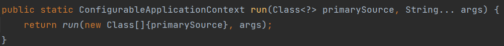

# SpringBoot基础

### 概念

**简介**

Spring Boot是由Pivotal团队提供的全新框架，其设计目的是用来简化新Spring应用的初始搭建以及开发过程。该框架使用了特定的方式来进行配置，从而使开发人员不再需要定义样板化的配置。


**微服务**

微服务是指一种架构风格（服务微化），它将系统围绕业务领域进行构建，服务间使用轻量级接口通信（通常是基于HTTP的RESTful API），各业务领域服务可独立部署，可独立数据存储，可使用不同的技术栈。

微服务提倡将单一应用程序划分成一组小的服务，服务之间互相协调、互相配合，为用户提供最终价值。

SpringBoot中嵌入了Tomcat、Jetty或Undertow，可以独立运行，不需要部署；为了独立性，SpringBoot直接把web服务集成在框架里，项目创建后，直接启动就可以是一个微服务，这种方式省去了部署过程。


**特点**

- 自动配置
  Spring Boot的自动配置是一个运行时（更准确地说，是应用程序启动时）的过程，考虑了众多因素，才决定
  Spring配置应该用哪个，不该用哪个。该过程是SpringBoot自动完成的。
- 起步依赖
  起步依赖本质上是一个Maven项目对象模型（Project Object Model，POM），定义了对其他库的传递依赖
  ，这些东西加在一起即支持某项功能。
  简单的说，起步依赖就是将具备某种功能的坐标打包到一起，并提供一些默认的功能。
- 辅助功能
  提供了一些大型项目中常见的非功能性特性，如嵌入式服务器、安全、指标，健康检测、外部配置等。


**起步依赖**

实现：项目继承spring-boot-start-parent坐标，spring-boot-start-parent坐标下又继承spring-boot-dependencies，该坐标下存放springboot依赖各包的默认版本信息

作用：

- 在spring-boot-starter-parent中定义了各种技术的版本信息，组合了一套最优搭配的技术版本。
- 在各种starter中，定义了完成该功能需要的坐标合集，其中大部分版本信息来自于父工程。
- 我们的工程继承parent，引入starter后，通过依赖传递，就可以简单方便获得需要的jar包，并且不会存在
  版本冲突等问题。


### 配置文件

##### 介绍

SpringBoot是基于约定的，我们可以使用全局配置文件对自定义属性进行配置。主要包括application.properties或者application.yml进行配置。

**作用：**修改SpringBoot自动配置的默认值

**注意点:**

* yaml和yml都是指同一种文件类型
* 默认配置文件名称：application，springboot会自动读取该文件名的配置文件。
* 如果同时有多种配置文件，则在同一级目录下优先级为：properties > yml > yaml

**分类：**

(1) properties格式

properties⽂件是⼀种属性⽂件，这种⽂件以key=value格式存储内容。

(2) yml格式

YAML是一种直观的能够被电脑识别的的数据数据序列化格式，并且容易被人类阅读，容易和脚本语言交互的，可以被支持YAML库的不同的编程语言程序导入。YML文件是以数据为核心的，比传统的xml方式更加简洁。

语法格式：`key:(空格)value`  数据值value前边必须有空格

**配置读取顺序：**

Springboot程序启动时，会从以下位置加载配置文件（加载顺序为以下排列顺序）：

1. file:./config/：当前项目下的/config目录下（这里的file指当前module以上一层的项目目录）
2. file:./ ：当前项目的根目录
3. classpath:/config/：classpath的/config目录
4. classpath:/ ：classpath的根目录


##### yml语法

**具体细节：**

- 大小写敏感；
- 数据值前边必须有空格，作为分隔符；
- 使用缩进表示层级关系； 
- 缩进时不允许使用Tab键，只能使用空格；缩进的空格数目不重要，只要相同层级的元素左侧对齐即可；
- \# 表示注释，从这个字符一直到行尾，都会被解析器忽略；
- “ ” 双引号，不会转义字符串里面的特殊字符；‘ ’单引号，会转义特殊字符

**数据类型：**

yaml支持的三种数据结构

- 对象：键值对的集合

  ```yaml
  person:
    name: zhangsan
  ```

  我们常会将字面量的值传入到对象内，比如：

  ```yaml
  name: zhangsan
  person:
    name: ${name}
  ```

- 数组：一组按次序排列的值

  ```yaml
  address:
    - beijing
    - shanghai
  ```

- 字面量：单个的、不可再分的值

  ```yaml
  msg1: 'hello \n world'  # 单引忽略转义字符
  msg2: "hello \n world"  # 双引识别转义字符
  ```


##### 配置读取

（1）在需要注入的属性上添加注解：`@Value()`

将yml文件中的普通属性注入类属性，再获取配置属性。（适合于需要注入值较少的情况，其他情况较为繁琐）

```java
//将yml文件中person对象的name属性进行注入
@Value("${name}")
private String name1;

@Value("${person.name}")
private String name2;
```

（2）通过Environment对象获取配置文件中的属性值。（在springboot启动时会在容器中自动创建Environment对象用于存放各类配置）

再通过env对象的getProperty方法获取配置属性。

```java
//将容器中的Environment对象属性注入到env中
@Autowired
private Environment env;

@GetMapping("/hello")
public String hello(){
    System.out.println(env.getProperty("person.age"));
    return "success";
}
```

（3）通过在类上添加注解：`@ConfigurationProperties()`以及`@Component`

@ConfigurationProperties注解可以获取配置文件中的属性并绑定到Java Bean或属性中。

这里需要添加prefix属性表示自动添加前缀，即对应yml配置文件中的对象、properties文件中的前缀。

pojo类中：

```java
@Component
@ConfigurationProperties(prefix = "person")
public class Person {
    private String name;
    private int age;
    //...
    //getter setter toString
}
```

controller类中：

```java
@Autowired
private Person person;
@GetMapping("/hello")
public String hello(){
    System.out.println(person);
    System.out.println(person.getName());
    System.out.println(person.getAge());
    System.out.println(Arrays.toString(person.getAddress()));
    return "success";
}
```


##### 多环境配置

我们在开发Spring Boot应用时，通常同一套程序会被安装到不同环境，比如：开发、测试、生产等。其中数据库地址、服务器端口等等配置都不同，如果每次打包时，都要修改配置文件，非常麻烦。因此我们使用profile功能进行动态配置切换的。


**实现：**

* profile配置文件方式
  * 多profile文件方式：提供多个配置文件，每个代表一种环境

  ```
  properties文件指定：spring.profiles.active=test
  yml文件指定：spring.profiles.active: test
  ```

  * yml多文档方式：在yml文件中针对多个环境用---隔开

      ```yaml
      # 下面配置选择pro环境进行激活，端口号选择8082
      ---
      server:
        port: 8081
      spring:
        profiles: dev
      ---
      server:
        port: 8082
      spring:
        profiles: pro
      ---
      spring:
        profiles:
          active: pro
      ```

* 虚拟机参数：在idea的运行配置中的VM options 指定 `-Dspring.profiles.active=dev`（会覆盖配置文件的配置）

* 命令行参数：
  * 在idea的运行配置中的Active profiles指定  `--spring.profiles.active=dev`（会覆盖配置文件的配置）
  * 首先通过maven-Lifecycle-package将文件打包为jar包，再输入如下命令行：
    `java –jar xxx.jar --spring.profiles.active=dev`


### 整合框架

##### Junit

**起步依赖：**（1）spring-boot-starter-test；

**相关注解：**

* `@RunWith(SpringRunner.class)`

  该注解为Springboot的测试启动器，用于加载Springboot的测试注解。JUnit将调用它所引用的类来运行该类中的测试而不是在Junit内部去构建它。

  比如：当测试类A用到类B的实例的时候，会首先将springboot运行起来，然后直接从容器中获取B的实例，而不是去new一个B对象。

* `@SpringBootTest(classes = 启动类.class)`

  该注解用于针对Springboot某个完整的业务功能进行测试。

  注意点：

  * 如果该测试类和启动类在同一个包或者在该包的子包下，则不需要指定classes属性；

* `@ActiveProfiles(profiles = "dev")`

  指定Springboot Test需要的Profiles。


##### Redis

**起步依赖：**spring-boot-starter-data-redis（亲测2.7.1无法注入redisTemplate）

**相关操作：**

* 修改Redis配置：

  ```yml
  spring:
    redis:
      host: 127.0.0.1 # redis的主机ip
      port: 6379
  ```

* 打开Redis服务器

* 测试类中测试Redis，设置属性、读取属性。

  ```java
  @RunWith(SpringRunner.class)
  @SpringBootTest
  public class SpringbootRedisApplicationTests {
      @Autowired
      private RedisTemplate redisTemplate;//注入redis模板
      @Test
      public void testSet() {
          //存入数据
          redisTemplate.boundValueOps("name").set("zhangsan");
      }
  
      @Test
      public void testGet() {
          //获取数据
          Object name = redisTemplate.boundValueOps("name").get();
          System.out.println(name);
      }
  }
  ```


##### MyBatis

**起步依赖：**mybatis-spring-boot-starter

**两种实现方式：**（1）基于注解；（2）基于xml配置文件

**原理：**

**@Mapper**

该注解用于Mapper接口上，可以将该接口交给Spring进行管理，添加该注解可以省去在核心文件中对mapper映射的配置。当我们需要使用数据库的操作时，可以将容器中的mapper对象进行注入。

在spring底层的容器中是通过动态代理方式对mapper接口进行实现的。


**实现步骤：**

* 通过yml文件配置spring数据源

  ```yaml
  spring:
    datasource:
      url: jdbc:mysql:///springboot?serverTimezone=UTC
      username: root
      password: root
      driver-class-name: com.mysql.cj.jdbc.Driver
  ```

* 基于注解

  1. 创建Mapper接口，在方法上添加sql语句注解

     在接口上添加@Mapper接口，该接口是mybatis自带注解，用于添加该接口作为映射（相当于核心配置类中的mapper）

     ```java
     @Mapper
     public interface UserMapper {
         @Select("select * from t_user")
         public List<User> findAll();
     }
     ```

  2. 测试，通过@Autowired将底层通过动态代理实现的mapper对象进行注入。

     ```java
     public class SpringMybatisApplicationTests {
         @Autowired
         private UserMapper userMapper;
     	@Test
         public void testFindAll() {
             List<User> userList = userMapper.findAll();
             System.out.println(userList);
         }
     }
     ```

* 基于xml配置文件

  1. 创建Mapper接口，添加@Mapper接口

     ```java
     @Mapper
     public interface UserXmlMapper {
         public List<User> findAll();
     }
     ```

  2. 创建xml配置文件，创建sql语句，指定返回类型（注意语句id和方法名对应；mapper的namespace与mapper接口全路径）

     ```xml
     <mapper namespace="com.example.springmybatis.mapper.UserXmlMapper">
         <select id="findAll" resultType="user">
             select * from t_user
         </select>
     </mapper>
     ```

  3. 在yml文件中配置映射文件以及别名

     ```yaml
     mybatis:
       mapper-locations: classpath:mapper/*Mapper.xml # mapper映射文件路径
       type-aliases-package: com.example.springmybatis.domain
     ```

  4. 测试同上。

**注意点：**

1、@Mapper不需要配置扫描地址，可以单独使用，如果有多个mapper文件的话，可以在项目启动类中加入@MapperScan(“mapper文件所在包”)
2、@Repository不可以单独使用，否则会报错误，要想用，必须配置扫描地址（@MapperScannerConfigurer）


##### 切换web服务器

在spring-boot-starter-web中排除spring-boot-starter-tomcat依赖，添加spring-boot-starter-jetty依赖即可。


---


# SpringBoot底层原理

### 自动配置

##### 启动类

**启动类的代码：**

```java
@SpringBootApplication
public class SpringbootConditionApplication {
    public static void main(String[] args) {
        SpringApplication.run(SpringbootConditionApplication.class, args);
    }
}
```

通过run方法，实际上有两个作用：（1）启动SpringBoot的应用；（2）返回Spring的容器ConfigurableApplicationContext；




**启动类注解：**

**（1）@SpringBootApplication**

@SpringBootApplication是启动类的注解，其内部包含：

```java
@Target({ElementType.TYPE}) //用于指定作用的位置（类）
@Retention(RetentionPolicy.RUNTIME) //用于指定注解生效的时间（运行时生效）
@Documented	//用于生成javadoc文档
@Inherited //指明父类注解会被子类继承得到
@SpringBootConfiguration //即注解类
@EnableAutoConfiguration //自动配置类
@ComponentScan(
    excludeFilters = {@Filter(
    type = FilterType.CUSTOM,
    classes = {TypeExcludeFilter.class}
), @Filter(
    type = FilterType.CUSTOM,
    classes = {AutoConfigurationExcludeFilter.class}
)}
) //定义扫描范围（当前引导类所在包及其子包）
```

分析：

* @Target 、@Retention、@Documented、@Inherited是启动类的元注解，用于修饰其他注解；
* @SpringBootConfiguration表示该启动类为配置类，与@Configuration相同；
* @ComponentScan定义了启动类的组件扫描范围；
* @EnableAutoConfiguration为自动配置注解，主要通过`@Import(ImportSelectorImpl.class)`进行启动类引入内容的自动加载 


**（2）@EnableAutoConfiguration**

@EnableAutoConfiguration是启动类的核心注解，确定了哪些类需要在启动时被加载，其内部包含：

```java
@Target({ElementType.TYPE})
@Retention(RetentionPolicy.RUNTIME)
@Documented
@Inherited
@AutoConfigurationPackage
@Import({AutoConfigurationImportSelector.class})
```

**注意点：**


* 配置文件位置：META-INF/spring.factories，该配置文件中定义了大量的配置类，当 SpringBoot 应用启动时，会自动加载这些配置类，初始化Bean。
* 并不是所有的Bean都会被初始化，在配置类中使用Condition来加载满足条件的Bean

**原理：**

AutoConfigurationImportSelector为自动配置的核心类，其内部的方法selectImports，返回值为字符串数组，定义了需要被加载的类。

```java
public String[] selectImports(AnnotationMetadata annotationMetadata) {
    if (!this.isEnabled(annotationMetadata)) {
        return NO_IMPORTS;
    } else {
        AutoConfigurationMetadata autoConfigurationMetadata = AutoConfigurationMetadataLoader.loadMetadata(this.beanClassLoader);
        AnnotationAttributes attributes = this.getAttributes(annotationMetadata);
        List<String> configurations = this.getCandidateConfigurations(annotationMetadata, attributes);//关键步骤,获取configurations列表（配置集合）
        configurations = this.removeDuplicates(configurations);
        Set<String> exclusions = this.getExclusions(annotationMetadata, attributes);
        this.checkExcludedClasses(configurations, exclusions);
        configurations.removeAll(exclusions);
        configurations = this.filter(configurations, autoConfigurationMetadata);
        this.fireAutoConfigurationImportEvents(configurations, exclusions);
        return StringUtils.toStringArray(configurations);
    }
}
```

getCandidateConfigurations方法，通过META-INF/spring.factories文件中的配置，决定需要被加载的类。

```java
protected List<String> getCandidateConfigurations(AnnotationMetadata metadata, AnnotationAttributes attributes) {
    List<String> configurations = SpringFactoriesLoader.loadFactoryNames(this.getSpringFactoriesLoaderFactoryClass(), this.getBeanClassLoader());
    Assert.notEmpty(configurations, "No auto configuration classes found in META-INF/spring.factories. If you are using a custom packaging, make sure that file is correct.");
    return configurations;
}
```

在使用时，通过Condition注解进行条件判断进行注入。


##### Condition注解

Condition 是在Spring 4.0 增加的条件判断功能，通过这个可以功能可以实现选择性的创建 Bean 操作。

**（1）一般条件判断**

步骤：

1. 定义条件类：自定义类实现Condition接口，重写 matches 方法，在 matches 方法中进行逻辑判断，返回boolean值 。
2. 在初始化Bean时，使用 `@Conditional(条件类.class)`注解，根据matches方法返回true/false决定是否在容器中创建bean对象。

e.g.

定义自定义Condition类实现Condition接口

```java
public class ClassCondition implements Condition {
    @Override
    public boolean matches(ConditionContext context, AnnotatedTypeMetadata metadata) {
        boolean flag = true;
        //判断Jedis.class文件是否存在
        try {
            Class<?> aClass = Class.forName("redis.clients.jedis.Jedis");
        } catch (ClassNotFoundException e) {
            flag=false;
        }
        return flag;
    }
}
```

通过注解和Condition类根据条件判断创建bean对象

```java
@Configuration
public class UserConfig {
    @Bean
    @Conditional(ClassCondition.class)
    public User user(){
        return new User();
    }
}
```

**（2）自定义注解方式**

创建自定义注解类@interface。

* 在自定义注解中添加`@Conditional(自定义Condition类.class)` ；
* 添加Target/Retention/Documented的元注解；
* 添加value属性（也可以添加其他属性）

```java
@Target({ElementType.TYPE, ElementType.METHOD}) //表示该注解生效的位置
@Retention(RetentionPolicy.RUNTIME) //表示该注解生效的时间
@Documented //生成javadoc的文档
@Conditional(ClassCondition.class)
public @interface ConditionOnClass {
    String[] value();
}
```

通过自定义Condition类-matches的形参动态判断相关条件（使用反射）

 matches 方法两个参数：

- context：上下文对象，可以获取属性值，获取类加载器，获取BeanFactory等。
- metadata：元数据对象，用于获取注解属性。

```java
public class ClassCondition implements Condition {
    @Override
    public boolean matches(ConditionContext context, AnnotatedTypeMetadata metadata) {
    Map<String, Object> map = metadata.getAnnotationAttributes(ConditionOnClass.class.getName());//获取通过@ConditionOnClass注解的属性，以哈希表形式获取
        String[] value = (String[])map.get("value");//获取value属性对应的值
        boolean flag = true;
        for(String className:value){
            try {
                Class<?> aClass = Class.forName(className);
            } catch (ClassNotFoundException e) {
                flag=false;
            }
        }
        return true;
    }
```

使用自定义的注解进行条件判断

```java
@Configuration
public class UserConfig {
    @Bean
    @ConditionOnClass("redis.clients.jedis.Jedis")
    public User user(){
        return new User();
    }
}
```


**（3）内部注解**

以下注解位于autoconfigure包下：

`@ConditionalOnProperty(name="" havingValue="")`：判断配置文件中是否有对应属性和值才初始化Bean

`@ConditionalOnClass(xxx.class)`：判断环境中是否有对应字节码文件才初始化Bean

`@ConditionalOnMissingBean(name=beanName)`：判断环境中没有对应Bean才初始化Bean

e.g.

```java
//存在对应字节码文件再创建bean对象
@Bean
@ConditionOnClass(RedisTemplate.class)
public User user(){
    return new User();
}

//application配置文件存在指定键值对再创建bean对象
@Bean
@ConditionalOnProperty(name="itcast",havingValue = "itheima")
public User user2(){
    return new User();
}

@Bean
@ConditionalOnMissingBean(name = "redisTemplate")
public User user3(){
    return new User();
}
```


##### Import注解

SpringBoot中提供了很多Enable开头的注解，这些注解都是用于动态启用某些功能的。而其底层原理是使用@Import注解导入一些配置类，实现Bean的动态加载。

使用@Import导入的类会被Spring加载到IOC容器中。而@Import提供四种用法：

* 导入Bean
* 导入配置类
* 导入 ImportSelector 实现类。一般用于加载配置文件中的类
* 导入 ImportBeanDefinitionRegistrar 实现类。

**实现：**

*以下实现均需要先在当前模块的pom文件中引入另一个模块的坐标

**（1）直接导入Bean对象**

使用注解：`@Import(beanClazz.class)`

在启动类上添加@Import注解引入Bean的Class对象。

```java
import com.example.domain.User;//引入包

@Import(User.class)//引入bean对象
@SpringBootApplication
@EnableUser
public class SpringbootEnableApplication {
    public static void main(String[] args) {
        ConfigurableApplicationContext context = SpringApplication.run(SpringbootEnableApplication.class, args);
        Object user = context.getBean(User.class);//这里不能用名称导入，因为导入的bean对象名称不确定
        Map<String, User> map = context.getBeansOfType(User.class);//返回所有User类型对应的bean的Map（名称-对象）
        //{com.example.domain.User=com.example.domain.User@25bfcafd}
        //可以看到名称为另一个模块中的包+类名
        System.out.println(map);
    }
}
```


**（2）导入配置类**

使用注解：`@Import(configClass.class)`

有两种方式：直接导入和自定义注解

* 直接导入

  1. 创建实体类（略）

  2. 创建配置类（由于@Import 注入主要看@Bean方法的返回值，因此被引入的注解类可以不添加@Configuration注解）

     ```java
     public class UserConfig {
         @Bean
         public User user(){
             return new User();
         }
         @Bean
         public Role role(){
             return new Role();
         }
     }
     ```

  3. 引入外部配置类所在模块，使用@Import导入配置类

      ```java
      @Import(UserConfig.class)
      @SpringBootApplication
      public class SpringbootEnableApplication {
          public static void main(String[] args) {
              ConfigurableApplicationContext context = SpringApplication.run(SpringbootEnableApplication.class, args);
              Object user = context.getBean("user");
              Object role = context.getBean("role");
              System.out.println(user);
              System.out.println(role);
          }
      }
      ```

* 自定义注解

  1. 创建实体类和配置类（略）

  2. 自定义创建注解类，在注解类上添加元注解，使用@Import导入配置类

      ```java
      @Import(UserConfig.class) //@Import注解中引入另一个模块的配置类，在配置类中有bean对象的注入
      @Target({ElementType.TYPE})
      @Retention(RetentionPolicy.RUNTIME)
      @Documented
      public @interface EnableUser {
      }
      ```

  3. 引入定义注解所在的外部模块，在本模块中添加自定义的注解

      ```java
      import com.example.config.EnableUser;

      @SpringBootApplication
      @EnableUser
      public class SpringbootEnableApplication {
          public static void main(String[] args) {
              ConfigurableApplicationContext context = SpringApplication.run(SpringbootEnableApplication.class, args);
              Object user = context.getBean("user");
          }
      }
      ```


**（3）导入 ImportSelector 实现类**

使用注解：`@Import(ImportSelectImpl.class)`

创建ImportSelector类实现该接口，在重写方法selectImports的返回值中添加需要导入的方法

```java
public class MyImportSelector implements ImportSelector {
    @Override
    public String[] selectImports(AnnotationMetadata importingClassMetadata) {
        return new String[]{"com.example.domain.User","com.example.domain.Role"};
    }
}

```

在本模块添加@Import注解，引入该实现类


**（4）导入ImportBeanDefinitionRegistrar实现类**

使用注解：`@Import(ImportBeanDefinitionRegistrarImpl.class)`

创建ImportBeanDefinitionRegistrar类实现该接口，重写registerBeanDefinitions方法，注册需要注入的bean对象。

```java
public class MyImportBeanDefinitionRegistrar implements ImportBeanDefinitionRegistrar {
    @Override
    public void registerBeanDefinitions(AnnotationMetadata importingClassMetadata, BeanDefinitionRegistry registry) {
        AbstractBeanDefinition beanDefinition = BeanDefinitionBuilder.rootBeanDefinition(User.class).getBeanDefinition();
        registry.registerBeanDefinition("user", beanDefinition);
    }
}
```


##### 自定义starter

使用注解：

`@EnableConfigurationProperties`：将springboot配置文件的值与@ConfigurationProperties修饰类的属性绑定（进行注入）

`@ConfigurationProperties `：springboot中用于标识需要读取配置文件的类

`@ConditionalOnClass` ：见Condition注解

`@ConditionalOnMissingBean`：见Condition注解


步骤（以redis为例）：

（1）创建 redis-spring-boot-autoconfigure 模块；

（2）创建 redis-spring-boot-starter 模块,依赖 redis-spring-boot-autoconfigure的模块；

（3）在 redis-spring-boot-autoconfigure 模块中初始化 Jedis 的Bean。并定义META-INF/spring.factories 文件；

```java
@Configuration
@EnableConfigurationProperties(RedisProperties.class) //注入配置文件类
@ConditionalOnClass(Jedis.class) //表示存在Jedis类时再进行配置
public class RedisAutoConfiguration {
    /**
     * 提供Jedis的bean
     */
    @Bean
    @ConditionalOnMissingBean(name = "jedis") //表示不存在bean对象jedis时才使用以下方法注入
    public Jedis jedis(RedisProperties redisProperties) {//注入配置文件
        System.out.println("RedisAutoConfiguration....");
        return new Jedis(redisProperties.getHost(), redisProperties.getPort());
    }
}

//配置文件注入
@ConfigurationProperties(prefix = "redis") //表示在配置文件中默认通配redis.xxx
public class RedisProperties {
    private String host = "localhost";//设定默认值
    private int port = 6379;


    public String getHost() {
        return host;
    }

    public void setHost(String host) {
        this.host = host;
    }

    public int getPort() {
        return port;
    }

    public void setPort(int port) {
        this.port = port;
    }
}
```

（4）在测试模块中引入自定义的 redis-starter 依赖，测试获取Jedis 的Bean，操作 redis。


### 监听机制

SpringBoot 的监听机制，其实是对Java提供的事件监听机制的封装。

Java中的事件监听机制定义了以下几个角色：

* 事件：Event，继承 java.util.EventObject 类的对象
* 事件源：Source ，任意对象Object
* 监听器：Listener，实现 java.util.EventListener 接口 的对象

SpringBoot 在项目启动时，会对几个监听器进行回调，我们可以实现这些监听器接口，在项目启动时完成
一些操作。包括以下接口：

ApplicationContextInitializer、SpringApplicationRunListener、CommandLineRunner、ApplicationRunner

**说明：**

* CommandLineRunner、ApplicationRunner会在启动时自动调用，可以对数据库缓存进行预热；
* ApplicationContextInitializer、SpringApplicationRunListener需要在spring.factories中进行配置；
* ApplicationContextInitializer可以在项目未准备IOC容器前检测一些资源是否存在；
* SpringApplicationRunListener还需要添加有参构造器，可以监测项目的各个阶段（启动、环境加载、容器加载、启动成功/失败）

**流程：**

```
starting...项目启动中
environmentPrepared...环境对象开始准备
[Banner]
ApplicationContextInitializer....initialize
contextPrepared...上下文对象开始准备
2022-07-05 15:36:16.650  INFO 22712 --- [           main] c.i.s.SpringbootListenerApplication      : Starting SpringbootListenerApplication on MS-202205241509 with PID 22712 (started by tan in D:\Data\LearningMaterials\Springboot\day02\代码\springboot02)
2022-07-05 15:36:16.651  INFO 22712 --- [           main] c.i.s.SpringbootListenerApplication      : No active profile set, falling back to default profiles: default
contextLoaded...上下文对象开始加载
2022-07-05 15:36:16.857  INFO 22712 --- [           main] c.i.s.SpringbootListenerApplication      : Started SpringbootListenerApplication in 0.381 seconds (JVM running for 0.663)
started...上下文对象加载完成
ApplicationRunner...run
CommandLineRunner...run
running...项目启动完成，开始运行
```

