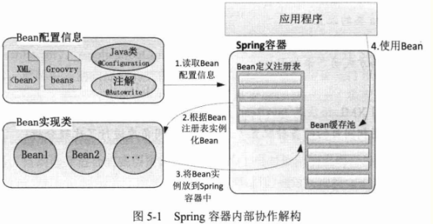
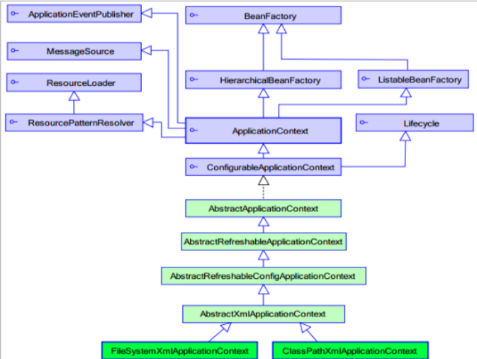
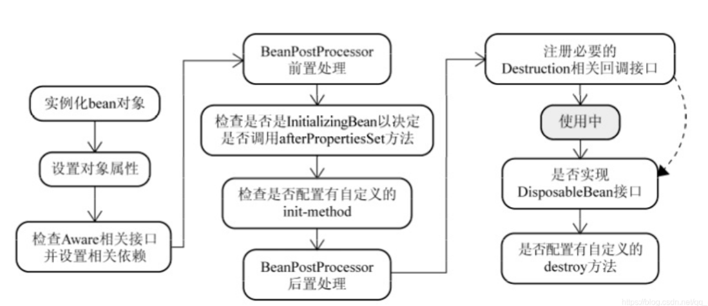
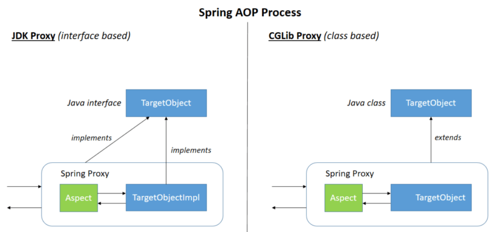
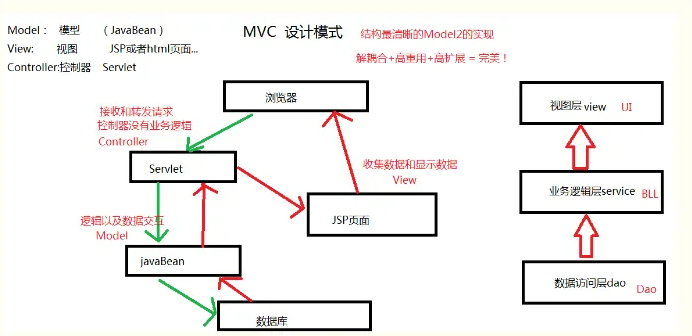
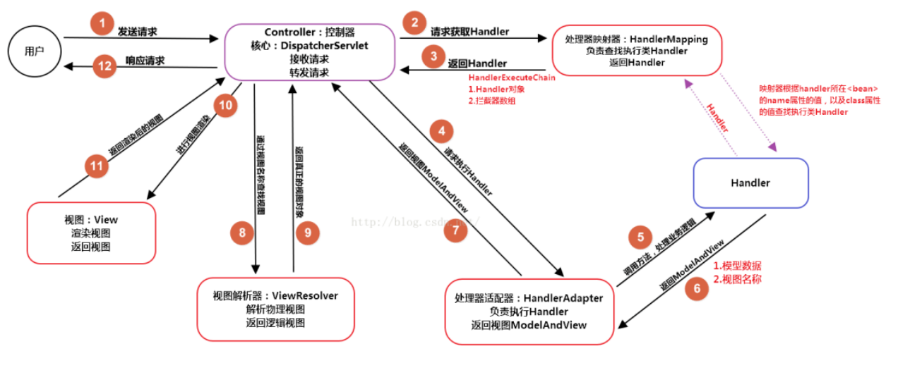
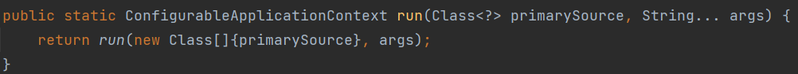

typora-copy-images-to: assets
typora-root-url: assets

# Spring

### 概述

Spring是轻量级开源的JavaEE框架，引入jar包很少。提供了功能强大的IOC和Aop（两大核心部分）及Web MVC等功能。

**目的：**用于解决企业应用开发的复杂性。

**IOC：**控制反转，把创建对象过程交给Spring进行管理。

**AOP：**面向切面，不修改源代码的前提下进行功能增强。

**特点：**

（1）方便解耦，简化开发；（2）AOP编程支持；（3）方便程序的测试；（4）方便和其它框架进行整合；（5）方便进行事务管理操作；（6）降低Java API的开发和使用难度

**基本jar包：**Beans、Core、Context、Expression


**创建Bean对象过程：**

(1) 在src下创建xml配置文件Spring config，并添加bean标签<bean id="user" class="com.company.User"></bean>

(2) 在测试类中添加测试方法，用`@Test`修饰；

(3) 读取配置文件：`ApplicationContext context = new ClassPathXmlApplicationContext("bean1.xml");`

(4) 创建对象：`User user = context.getBean("user", User.class);`

(5) 调用对象进行代码测试。


**Java结构**

Java的结构大致可以分为三层：

1. Controller层（控制层）：接收客户端的请求，然后调用Service层接口控制业务逻辑，获取到数据，传递数据给页面；
2. Service层（业务层、服务层）：接收Controller层的请求，然后调用Dao层，获取到数据，service层也叫服务层，主要负责业务模块的逻辑；
3. DAO 层（数据操作层）：连接数据库，对数据库进行操作，具体到对于某个表的增删改查，也就是说某个DAO一定是和数据库的某一张表一一对应的，其中封装了增删改查基本操作

**调用流程：**


Service层是建立在DAO层之上的，建立了DAO层后才可以建立Service层，而Service层又是在Controller层之下的，因而 Service层应该既调用DAO层的接口，又要提供接口给Controller层的类来进行调用，它刚好处于一个中间层的位置。 每个模型都有一个Service接口，每个接口分别封装各自的业务处理方法。


### XML文件

##### **介绍**

xml（Extensible Markup Language）可拓展标记语言。是一种用于标记电子文件使其具有结构性的标记语言。

**特点：**

* XML简单易于在任何应用程序中读/写数据
* xml可用作数据的说明、储存、传输
* xml文件现在多用于作配置文件
* 作为系统与系统之间的传输数据的格式

**xml和html比较：**

* xml文档的标记可以随意扩展，html的标记是预定义的
* xml区分大小写，html不区分大小写
* html主要是用来显示数据的，xml是用来保存数据的
* html中，空格会自动过滤，而xml不会
* html中可以有多个根节点，在xml里面只有一个


##### **语法**

**结构：**一个XML文件通常包含**文件头**和**文件体**两大部分，具体可以分为XML声明（必须拥有）、DTD文档类型定义、XML正文。

**文件头（处理指令）**

处理指令主要用于来给处理XML文件的应用程序提供信息的，处理指令的格式：<?处理指令名称 处理指令信息?>

e.g. `<?xml version="1.0" encoding="UTF-8" standalone="yes"？>`

- version：用来表示XML的版本号
- encoding：指定XML编码格式
- standalone：用来表示XML文件是否依赖外部的文件

**文件体**

XML元素定义：`<元素名></元素>`

属性定义：`<元素名 属性="属性值" 属性2="属性值2"></元素>`

注释定义`<!-- 这是一条注释-->`


**转义字符**

\&gt;	大于>

\&lt;	小于<

\&amp;	和号&

\&apos：	单引号‘

\&quot：	引号“


**注意点：**

* xml的标记不能以xml，数字或者下划线开头
* 标签中的属性值要加双引号
* XML**标记**与HTML标记相同，“<”表示一个标记的开始，“>” 表示一个标记的结束。XML中只要有起始标记，就必须有结束标记，而且在使用嵌套结构时，标记之间不能交叉。
* 在XML中不含任何内容的标记叫做**空标记**，格式为：<标记名称/>


##### **结构**

**文件头**

XML文件头由XML声明与DTD文件类型声明组成。其中DTD文件类型声明是可以缺少的，而XML声明是必须要有的，以使文件符合XML的标准规格。**XML声明必须出现在文档的第一行。**

e.g.: `<?xml version="1.0" encoding="gb2312"?>`

解释：

* “< ?”代表一条指令的开始， “?>”代表一条指令的结束；

* “xml”代表此文件是XML文件；
* “ version="1.0" ”代表此文件用的是XML1.0标准；
* “ encoding="gb2312" ” 代表此文件所用的字符集，默认值为Unicode，如果该文件中要用到中文，就必须将此值设定为gb2312。


**文件体**

文件体中包含的是XML文件的内容，XML元素是XML文件内容的基本单元。从语法讲，一个元素包含一个**起始标记**、一个**结束标记**以及标记之间的**数据内容**。

所有的数据内容都必须在某个标记的开始和结束标记内，而每个标记又必须包含在另一个标记的开始与结束标记内，形成嵌套式的分布，只有最外层的标记不必被其他的标记所包含。最外层的是**根元素(Root)**，又称**文件(Document)元素**，所有的元素都包含在根元素内。

**语法：**<标记名称 属性名1="属性值1" 属性名2=“属性值2" ……>内容</标记名称>	(XML元素与HTML元素的格式基本相同)


---


### IOC容器

主要内容：IOC底层原理、IOC接口（BeanFactory)、IOC具体操作（Bean管理【基于xml、基于注解】）

##### 概念

控制反转(Inversion of Control, IOC)，是面向对象编程中的一种设计原则，用来**减低代码之间的耦合度**。通过控制反转，对象在被创建的时候，由一个调控系统内所有对象的外界实体将其所依赖的对象的引用传递给它。

也就是说：**把对象创建和对象之间的调用过程，交给Spring进行管理**。


##### 底层原理

**使用技术：**（1）使用设计模式：工厂模式；（2）xml解析；（3）使用反射。

e.g.

```java
class UserFactory{
    public static UserDao getDao(){
        String classValue = "className";
        Class clazz = Class.forName(classValue);//通过反射创建对象
        return (UserDao)clazz.newInstance();
    }
}
```

**结构图：**



**基本要点：**

* IOC思想需要基于IOC容器，IOC底层是一个对象工厂；
* Spring提供了IOC容器实现的两种方式：
  * BeanFactory接口：是IOC容器基本实现方式，是Spring内部的使用接口，不提供给开发人员进行使用（加载配置文件时候**不会创建对象**，在获取对象时才会创建对象。）

  * ApplicationContext接口：BeanFactory接口的子接口，提供更多更强大的功能，提供给开发人员使用（加载配置文件时候就会把在配置文件的对象进行创建）【推荐使用，服务器在启动过程中就加载对象】功能包括：

    * 访问应用程序组件的Bean工厂方法。从org.springframework.beans.factory.ListableBeanFactory继承。

    * 以通用方式加载文件资源的能力。继承自org.springframe .core.io。ResourceLoader接口。

    * 向注册侦听器发布事件的能力。继承自ApplicationEventPublisher接口。

    * 解析消息的能力，支持国际化。继承自MessageSource接口。


##### FactoryBean

在Spring中有两种类型的bean，一种为普通bean，另外一种叫做FactoryBean。

普通bean：在bean配置文件中定义的类型返回对应的类型；

工厂bean：在bean配置文件中定义类型和返回类型不一致。


**创建工厂bean的步骤：**

- 创建类，让这个类作为工厂bean，实现接口FactoryBean；
- 实现接口中的方法，在实现方法中定义返回bean的类型。

实现：

```java
class factoryBean implements FactoryBean<BeanImp> {
    @Override
    public BeanImp getObject() throws Exception {
        return new BeanImp();
    }

    @Override
    public Class<?> getObjectType() {
        return BeanImp.class;
    }

    @Override
    public boolean isSingleton() {
        return true;
    }
}
```


##### API

（1）ApplicationContext

作用：ApplicationContext是接口类型，代表应用上下文，可以通过其实例获得 Spring 容器中的 Bean 对象。




（2）ApplicationContext的实现类

* ClassPathXmlApplicationContext：从类的根路径下加载配置文件（常用）
* FileSystemXmlApplicationContext：从磁盘路径上加载配置文件，配置文件可以在磁盘的任意位置
* AnnotationConfigApplicationContext：当使用注解配置容器对象时，需要使用此类来创建 spring 容器。用于读取注解。

（3）getBean()方法

```java
//常用的三种重载
//参数列表为bean的id
public Object getBean(String name) throws BeansException {
        this.assertBeanFactoryActive();
        return this.getBeanFactory().getBean(name);
    }

//参数为Class类型
public <T> T getBean(Class<T> requiredType) throws BeansException {
        this.assertBeanFactoryActive();
        return this.getBeanFactory().getBean(requiredType);
}

//根据bean的id和Class类型确定bean实例
public <T> T getBean(String name, Class<T> requiredType) throws BeansException {
    this.assertBeanFactoryActive();
    return this.getBeanFactory().getBean(name, requiredType);
}
```


当参数的数据类型是字符串时，表示根据bean的id从容器中获得Bean实例，返回是Object，需要强转。

当参数的数据类型是Class类型时，表示根据类型从容器中匹配Bean实例，当容器中相同类型的Bean有多个时，该方法报错。

当使用第三种方式获取bean实例时，不需要进行强转，也不需要担心有多个重复bean（因为id只有一个）。


---

### Bean基本知识

##### Bean作用域

在 Spring 中默认情况 bean 是单实例对象。需要设置作用域时：

（1）在 spring 配置文件 bean 标签里面有属性（scope）用于设置单实例还是多实例

（2）scope 属性值（默认）**singleton**，表示是单实例对象；另一种属性值 **prototype**，表示是多实例对象

```xml
<bean id="book" class="com.atguigu.spring5.collectiontype.Book" scope="prototype"><!--设置为多实例-->
        <property name="list" ref="bookList"></property>
</bean>
```

**注意点：**

设置 scope 值是 **singleton** 时，加载 spring 配置文件时就会创建单实例对象 ；

设置 scope 值是 **prototype** 时，不是在加载 spring 配置文件时候创建对象，在调用 getBean 方法时创建多实例对象


##### Bean生命周期

生命周期是对象从创建到销毁的过程，bean生命周期也就是bean对象的创建到销毁过程。



**在配置文件中的生命周期配置：**

`init-method`：指定类中的初始化方法

`destroy-method`：指定类中的销毁方法


**bean的生命周期过程：**

（1）通过反射调用构造器创建bean对象实例（无参构造）；

（2）通过依赖注入为bean对象装配属性（调用set方法）；

（3）实现了Aware接口的Bean，执行接口方法：如顺序执行BeanNameAware、BeanFactoryAware、ApplicationContextAware的接口方法；

（3）将bean实例传递给bean的前置处理器方法postProcessBeforeInitialization；

（4）顺序执行@PostConstruct注解方法、InitializingBean接口方法、init-method方法进行初始化；

（5）将bean实例传递给bean的后置处理器方法postProcessAfterInitialization

（6）得到bean对象，使用bean

（7）容器关闭后，调用bean的销毁方法，顺序是：@PreDestroy注解方法、DisposableBean接口
方法、destroy-method。


---


### 基于xml的Bean管理

**开发步骤：**

* 导入相关jar包
* 创建需要导入的Bean对象
* 创建context.xml配置文件，进行对象创建和属性注入
* 创建ApplicationContext对象获取容器中的bean


**重点配置：**

```xml
<bean>标签
id属性:在容器中Bean实例的唯一标识，不允许重复
class属性:要实例化的Bean的全限定名
scope属性:Bean的作用范围，常用是Singleton(默认)和prototype
<property>标签：属性注入
name属性：属性名称
value属性：注入的普通属性值
ref属性：注入的对象引用值
<list>标签
<map>标签
<properties>标签
<constructor-arg>标签
<import>标签:导入其他的Spring的分文件
```


##### 创建对象

在spring配置文件中，使用bean标签，标签里添加对应属性，即可完成对象的创建。

使用配置文件创建Bean对象有三种方式：

**（1）使用无参构造器实例化**

**语法：**``<bean id="user" class="com.company.User"></bean>``

**注意事项：**

* bean标签有很多属性，常用属性如下：
  * id属性【常用】：给相应对象添加别名，id是bean的唯一标识，IoC容器中bean的id不能重复，否则报错。
  * class属性【常用】：对象所属类的全路径，为bean的全限定类名，指向classpath下类定义所在位置。
  * name属性：name属性基本等同于id属性，不常用，name属性不能重复，且id和name属性也不能重复，和id的区别主要在于name属性可以添加符号。
* 创建对象时，默认调用类中的无参构造器方法，如果需要使用有参构造器，需要在bean标签中添加properties；


**（2）使用静态工厂实例化**

使用工厂的静态方法返回Bean实例。

**实现：**

以下程序实现了通过createUserDao这一工厂方法创建UserDao实例，并注入UserDaoImpl属性

```java
public class StaticFactoryBean{
    public static UserDao createUserDao(){
        return new UserDaoImpl();
    }
}
//配置文件中
<bean id="userDao" class="com.twhupup.factory.StaticFactoryBean" factory-method="createUserDao">
```


**（3）使用实例工厂实例化**

使用工厂的非静态方法返回Bean实例（需要先创建工厂类的bean实例）

**实现：**

以下程序实现了通过createUserDao这一工厂方法创建UserDao实例，并注入UserDaoImpl属性，但该方法是非静态的，因此需要在配置文件中先创建工厂的bean对象，再进行工厂bean和工厂方法的配置。

```java
public class DynamicFactoryBean{
    public UserDao createUserDao(){
        return new UserDaoImpl();
    }
}

//配置文件中
<bean id="factoryBean" class="com.twhupup.factory.DynamicFactoryBean">
<bean id="userDao" factory-bean="factoryBean" factory-method="createUserDao"/>
```


##### 注入一般属性

使用xml配置文件注入属性一般有两种方式：（1）通过构造方法注入；（2）通过setter方法注入。

**知识点：**

* 如果不写bean标签的方法体，则会默认调用无参构造器；
* 如果类有有参构造器，必须添加`<constructor-arg>`标签并添加所有属性的值。

**步骤：**

(1) 程序中创建需要实例化的类，定义相关属性；

(2) 在spring配置文件配置对象创建，配置属性注入；

(3) 在测试程序中加载xml文件，获取对象。


**方式一：用set()方法注入属性**

当类中存在set()方法时：

```xml
<bean id="book" class="com.company.Book">
    <!--在xml文件中进行属性注入-->
    <property name="name" value="红楼梦"></property>
</bean>
```


**方式二：通过有参构造器注入属性**

当类中存在有参构造器时：

```xml
<bean id="order" class="com.company.Order">
	<!--name属性也可以替换为index表示索引（如index=0表示有参构造器参数列表中的第一个属性），但不能和已经定义的属性重复-->
    <constructor-arg name="address" value="苏州"></constructor-arg>
    <constructor-arg name="name" value="快递"></constructor-arg>
</bean>
```


**方式三：p名称空间注入（了解）**

使用p名称空间注入，可以简化xml配置方式。p命名空间注入本质也是set方法注入，但比起上述的set方法注入更加方便。（需要定义setter方法）


**步骤：**

(1) 添加p名称空间在配置文件头部

`xmlns:p="http://www.springframework.org/schema/p"`

(2) 在bean标签进行属性注入（set方式注入的简化操作）

`<bean id="book" class="com.atguigu.spring5.Book" p:bname="very" p:bauthor="good"></bean>`


##### 根据类型注入属性

**注入其他类型属性**

(1) 向属性中设置空值：

```xml
<bean id="book" class="com.company.Book">
    <!--在xml文件中进行属性注入-->
    <property name="name" value="红楼梦"></property>
    <property name="price">
        <null/>
    </property>
</bean>
```

(2) 向属性中设置特殊值：

```xml
<bean id="book" class="com.company.Book">
    <!--在xml文件中进行属性注入-->
    <property name="name" value="红楼梦"></property>
	<property name="name">
    <!--将带特殊符号的内容写入到CDATA-->
    	<value><![CDATA[<<红楼梦>>]]></value>
	</property>
    <property name="price" value="10"></property>
</bean>
```


**注入集合类型属性**

（1）一般注入

注入数组类型属性

 ```xml
<property name="courses">
    <array>
        <value>java课程</value>
        <value>sql课程</value>
        <value>spring课程</value>
    </array>
</property>
 ```

注入List集合类型属性

```xml
<property name="list">
    <list>
        <value>twh</value>
        <value>sjy</value>
        <value>lm</value>
    </list>
</property>
```

注入Map集合类型属性

```xml
<property name="map">
    <map>
        <entry key="JAVA" value="java"/>
        <entry key="PHP" value="php"/>
    </map>
</property>
```

注入Set集合类型属性

```xml
<property name="set">
    <set>
        <value>java</value>
        <value>php</value>
        <value>mysql</value>
    </set>
</property>
```

(2) 在集合中设置对象类型值

```xml
<!--创建多个Course对象-->
<bean id="course1" class="com.twhupup.collectiontype.Course">
    <property name="name" value="Spring5框架"/>
</bean>
<bean id="course2" class="com.twhupup.collectiontype.Course">
    <property name="name" value="Mybatis框架"/>
<bean id="Stu" class="com.twhupup.collectiontype.Stu">
    <!--将创建的对象注入到集合类型中-->    
	<property name="courseList">
        <list>
            <ref bean="course1"/>
            <ref bean="course2"/>
        </list>
	</property>
</bean>
```

(3) 使用util标签提取list集合属性注入

```xml
<?xml version="1.0" encoding="UTF-8"?>
<beans xmlns="http://www.springframework.org/schema/beans"
       xmlns:xsi="http://www.w3.org/2001/XMLSchema-instance"
       xmlns:p="http://www.springframework.org/schema/p"
       <!--在spring配置文件中引入名称空间util-->
       xmlns:util="http://www.springframework.org/schema/util"
       xsi:schemaLocation="http://www.springframework.org/schema/beans http://www.springframework.org/schema/beans/spring-beans.xsd
                           http://www.springframework.org/schema/util http://www.springframework.org/schema/util/spring-util.xsd">
    <!--1.提取list集合类型属性-->
    <util:list id="bookList">
        <value>java指南</value>
        <value>php指南</value>
        <value>python指南</value>
    </util:list>
    <!--2.list集合类型属性注入-->
    <bean id="book" class="com.twhupup.collectiontype.Book">
        <property name="list" ref="bookList"/>
    </bean>
</beans>
```


**外部bean注入**

使用场景：调用**其他包**中的类

**步骤：**

(1) 创建service类和dao类，在service中调用dao的方法。

```java
public class UserService {//service类
    //创建UserDao类型属性，生成set方法
    private UserDao userDao;
    public void setUserDao(UserDao userDao) {
        this.userDao = userDao;
    }

    public void add() {
        userDao.update();//调用dao方法
    }
}
```
(2) 在spring配置文件中进行配置

```xml
<!--1 service和dao对象创建-->
<bean id="userService" class="com.atguigu.spring5.service.UserService">
    <!--注入userDao对象
        name属性：类里面属性名称
        ref属性：创建userDao对象bean标签id值
    -->
    <property name="userDao" ref="userDaoImpl"></property>
</bean>
<bean id="userDaoImpl" class="com.atguigu.spring5.dao.UserDaoImpl"></bean>
```


**内部bean注入**

使用场景：一个类中包含另一个类的对象

(1) 在同一个包内创建Dept类和Emp类，并生成set方法。

```java
//部门类
public class Dept {
    private String dname;
    public void setDname(String dname) {
        this.dname = dname;
    }
}

//员工类
public class Emp {
    private String ename;
    private String gender;
    //员工属于某一个部门，使用对象形式表示
    private Dept dept;
    
    public void setDept(Dept dept) {
        this.dept = dept;
    }
    public void setEname(String ename) {
        this.ename = ename;
    }
    public void setGender(String gender) {
        this.gender = gender;
    }
}
```

(2) 在spring配置文件中配置

```xml
    <bean id="emp" class="com.company.Emp">
        <property name="name" value="twh"/>
        <property name="age" value="18"/>
        <property name="dep">
            <bean class="com.company.Dep">
                <property name="name" value="microsoft"/><!--内部bean注入-->
            </bean>
        </property>
    </bean>
```

(2.1) 也可以通过级联赋值注入属性（类似于外部注入），在spring配置文件中配置

```xml
    <bean id="emp" class="com.twhupup.Emp">
        <property name="name" value="twh"/>
        <property name="age" value="18"/>
    	<property name="dep" ref="dep"></property>
    </bean>
    <bean id="dep" class="com.twhupup.Dep">
        <property name="name" value="microsoft"></property>
    </bean>
```


---


### 基于注解的Bean管理

**知识点**

（1）注解是代码的特殊标记，格式为`@注解名称(属性名1=属性值1，属性名2=属性值2...)`；

（2）注解可以作用在**类、方法、属性**中；

（3）注解的目的：用更简洁的方式配置管理xml文件；


##### 组件扫描

组件扫描用于从指定的classpath下自动扫描，侦测和实例化具有特定注解的bean。

对于扫描到的组件，Spring有**默认**的命名策略：使用非限定类名，第一个字母小写。
也可以在注解中通过value属性值标识组建的名称。不使用value属性标识Bean的名称，默认以类名小写命名。

当在组件类上使用了特定的注解之后, 还需要在 Spring 的配置文件中配置以下项：
base-package 属性指定一个需要扫描的基类包，Spring 容器将会扫描这个基类包里及其子包中的所有类，当需要扫描多个包时, 可以使用逗号分隔。

**用法1（include-filter）**

```xml
<context:component-scan base-package="com.twhupup" use-default-filters="false">
    <context:include-filter type="annotation" expression="org.springframework.stereotype.Service"/>
</context:component-scan>
```

- `use-default-filters`属性用于选择是否使用默认filter，如果值为false表示不扫描所有内容，而使用自己配置的filter（不设置`use-default-filters`属性，则其设为默认值true，表示需要扫描所有内容）
- `<context:include-filter>`标签写在`<context:component-scan>`的结构体内 ，设置filter中对指定的内容进行扫描
- `type="annotation" expression="org.springframework.stereotype.Service"/>` 表示在base-package的范围内只扫描Service的注解类

**用法2（exclude-filter）**

```xml
<context:component-scan base-package="com.twhupup">
    <context:exclude-filter type="annotation" expression="org.springframework.stereotype.Controller"/>
</context:component-scan>
```

- `<context:exclude-filter>`标签写在`<context:component-scan>`的结构体内 ，设置filter中哪些内容不进行扫描


**@ComponentScan**

我们使用`@ComponentScan`用于指定创建容器时要扫描的包。该注解在指定扫描的位置时，可以指定包名，也可以指定扫描的类。同时支持定义扫描规则，例如包含哪些或者排除哪些。同时，它还支持自定义Bean的命名规则。

在spring4.3版本之后还加入了一个@ComponentScans的注解，该注解就是支持配置多个@ComponentScan。

**属性：**

* value: 用于指定要扫描的包。当指定了包的名称之后，spring会扫描指定的包及其子包下的所有类。
* basePackages: 它和value作用是一样的。
* basePackageClasses: 指定具体要扫描的类的字节码。    
* nameGenrator: 指定扫描bean对象存入容器时的命名规则。
* scopeResolver: 用于处理并转换检测到的Bean的作用范围。
* soperdProxy: 用于指定bean生成时的代理方式。默认是Default，则不使用代理。
* resourcePattern: 用于指定符合组件检测条件的类文件，默认是包扫描下的  **/*.class
* useDefaultFilters: 是否对带有@Component @Repository @Service @Controller注解的类开启检测,默认是开启的。
* includeFilters: 自定义组件扫描的过滤规则，用以扫描组件。
  * FilterType有5种类型：
    ANNOTATION, 注解类型 默认
    ASSIGNABLE_TYPE,指定固定类
    ASPECTJ， ASPECTJ类型
    REGEX,正则表达式
    CUSTOM,自定义类型
* excludeFilters: 自定义组件扫描的排除规则。
* lazyInit: 组件扫描时是否采用懒加载 ，默认不开启。

**使用场景：**
 在注解驱动开发时，我们自己编写的类都使用注解的方式进行配置，要想让spring添加到ioc容器中，就需要使用此注解来实现组件的扫描。


##### 注入时机和条件

有三个注解用于设定注入的时机和注入的条件

**@DependsOn**

**作用：**用于指定某个类的创建依赖的bean对象先创建。spring中没有特定bean的加载顺序，使用此注解则可指定bean的加载顺序。(在基于注解配置中，是按照类中方法的书写顺序决定的)

**使用场景：**
在观察者模式中，分为事件，事件源和监听器。一般情况下，我们的监听器负责监听事件源，当事件源触发了事件之后，监听器就要捕获，并且做出相应的处理。以此为前提，我们肯定希望监听器的创建时间在事件源之前，此时就可以使用此注解。

**属性：**

* value： 用于指定bean的唯一标识。被指定的bean会在当前bean创建之前加载。


**@Lazy**

**作用：**用于指定单例bean对象的创建时机。在没有使用此注解时，单例bean的生命周期与容器相同。但是当使用了此注解之后，单例对象的创建时机变成了第一次使用时创建。

**使用场景：**
在实际开发中，当我们的Bean是单例对象时，并不是每个都需要一开始都加载到ioc容器之中，有些对象可以在真正使用的时候再加载，当有此需求时，即可使用此注解。值得注意的是，此注解只对单例bean对象起作用，当指定了@Scope注解的prototype取值后，此注解不起作用。

**属性：**

* value: 指定是否采用延迟加载。默认值为true，表示开启。


**@Conditional**

**作用：**它的作用是根据条件选择注入的bean对象。

**使用场景：**

当我们在开发时，可能会使用多平台来测试，例如我们的测试数据库分别部署到了linux和windows两个操作系统上面，现在根据我们的工程运行环境选择连接的数据库。此时就可以使用此注解。同时基于此注解引出的@Profile注解，就是根据不同的环境，加载不同的配置信息，详情请参考第五章第9小节@Profile的使用。

**属性：**

* value: 用于提供一个Condition接口的实现类，实现类中需要编写具体代码实现注入的条件。


##### 创建Bean对象

**方式：**

（1）@Component	普通注解

（2）@Service	一般用于service层的对象创建，也允许用在其他位置

（3）@Controller		一般用于web层，也允许用在其他位置

（4）@Repository	一般用于dao层，也允许用在其他位置

上述的四个注解功能都一样，都可以用于创建bean实例，分为若干方式主要用于方便开发

**属性：**

*  value：用于指定存入容器时bean的id。当不指定时，默认值为当前类的名称。

**实现：**

* 首先引入spring-aop的jar包（maven实现）

* 添加context名称空间

```xml
<beans xmlns="http://www.springframework.org/schema/beans"
       xmlns:xsi="http://www.w3.org/2001/XMLSchema-instance"
       xmlns:context="http://www.springframework.org/schema/context"
       xsi:schemaLocation="http://www.springframework.org/schema/beans http://www.springframework.org/schema/beans/spring-beans.xsd http://www.springframework.org/schema/context http://www.springframework.org/schema/context/spring-context.xsd">
```

* 开启组件扫描，提示spring使用注解方式（扫描多个包时，base-package的值可以填上层目录，或使用逗号隔开）

```xml
<context:component-scan base-package="com.twhupup"/>
```

* 创建相关类，在类上添加注解（注意，注入的bean名称为首字母小写后的类名）

```java
//在注解中,value属性值可以省略，默认为类名（首字母修改为小写）
@Service(value="userService")//相当于在bean文件中配置：<bean id="userService" class="com.twhupup.service.UserService"/>
public class UserService {
    public void add(){
        System.out.println("Service add");
    }
}
```


##### 注入属性

**方式：**

（1）@AutoWired	根据属性类型进行自动装配

（2）@Qualifier		根据属性名称进行注入

（3）@Resource		可以根据类型和名称注入

（4）@Value		注入普通类型属性（int/float/String...）


**@AutoWired**

@AutoWired是一种注解，可以对**成员变量、方法和构造函数**进行标注。

**属性：**

* required：是否必须注入成功。默认值是true，表示必须注入成功。当取值为true的时候，注入不成功会报错。

**注意点：**

* 使用注解方式注入属性不需要类具有set方法；
* @Autowired是根据类型进行自动装配的，如果需要按名称进行装配，则需要配合@Qualifier使用；

* @Autowired标注可以放在任意方法上表示，自动执行当前方法，如果方法有参数，会在IOC容器中自动寻找同类型参数为其传值。

* 一般不建议直接在成员变量上使用@Autowired注解，因为在java底层，是优先对构造方法进行初始化，再进行注解的解析的。因此我们会选择将@Autowired放在构造方法上，在构造方法中实现变量的注入，比如：

  ```java
  class UserAccountServiceImpl{
      //如果将注解写在该位置，则无法进行注入，因为jvm优先执行构造器，在构造方法中操作了被@Autowired修饰的user对象,实际上user的bean对象未注入属性，因此报空指针异常
      private User user;
      private String school;
  
      @Autowired
      public UserAccountServiceImpl(User user){
          this.user = user;
          this.school = user.getSchool();
      }
  }
  ```

**实现**

把service和dao对象进行创建，在service和dao类添加创建对象注释，在service中注入dao对象。此时Spring的组件扫描就会找到这两个类，将其初始化为bean对象注入到IOC容器中。

```java
@Repository
public class UserDaoImp1 implements UserDao{
    @Override
    public void add() {
        System.out.println("dao add...");
    }
}
//另一个包
@Service(value="userService")//相当于在bean文件中配置：<bean id="userService" class="com.twhupup.service.UserService"/>
public class UserService {
    @Autowired
    private UserDao userDao;//在这里使用AutoWired注释表示注入UserDao类型的对象（UserDao作为一个接口，根据多态原理会寻找其实现类）
    public void add(){
        System.out.println("Service add");
        userDao.add();
    }
}
```

这里使用spring进行注入而不通过new创建对象，是因为：**直接创建对象时会增加耦合性，将对象的创建交给ioc容器可以降低耦合性，同时对于对象的单例和多例可以有效的控制而不需要自己采取维护措施**


**@Qualifier** 

根据名称注入（这里的名称指注释的value值，默认为类名+首字母小写）。

当使用自动按类型注入时，遇到有多个类型匹配的时候，就可以使用此注解来明确注入哪个bean对象。注意它通常情况下都必须配置@Autowired注解一起使用

```java
@Service
public class UserService {
    @Autowired
    @Qualifier(value = "userDaoImp1")//根据名称注入；和AutoWired注释联合使用，在类型注入的同时确定注入类的名称
    private UserDao userDao;
    public void add(){
        System.out.println("Service add");
        userDao.add();
    }
}
```


**@Resource** 

此注解来源于JSR规范（Java Specification Requests），其作用是找到依赖的组件注入到应用来，它利用了JNDI（Java Naming and Directory Interface Java命名目录接口 J2EE规范之一）技术查找所需的资源。

默认情况下，即所有属性都不指定，它默认按照byType的方式装配bean对象。如果指定了name，没有指定type，则采用byName。如果没有指定name，而是指定了type，则按照byType装配bean对象。当byName和byType都指定了，两个都会校验，有任何一个不符合条件就会报错。

**注意点：**Resource是javax扩展包中的注解，不是spring官方的注解。

**属性：**

* name：资源的JNDI名称。在spring的注入时，指定bean的唯一标识。
* type：指定bean的类型。


**@Value**	

用于注入基本类型和String类型的数据。它支持spring的EL表达式，可以通过${} 的方式获取配置文件中的数据。配置文件支持properties,xml和yml文件。

**属性：**

* value: 指定注入的数据或者spring的el表达式。

**使用场景：**
在实际开发中，像连接数据库的配置，发送邮件的配置等等，都可以使用配置文件配置起来。此时读取配置文件就可以借助spring的el表达式读取。

```java
@PropertySource("classpath:jdbc.properties")
public class JdbcConfig {
    @Value("${driver}")
    private String driver;
    @Value("${url}")
    private String url;
    @Value("${username}")
    private String username;
    @Value("${password}")
    private String password;
    //其它注入
}
```

**注意点：**@Value注释的注入属性会滞后于属性的自定义赋值


**@Primary**

**作用：**在需要注入的实现类上添加@Primary注解，可以通知IOC容器优先使用该标注的bean对象进行注入。

**使用场景：**当一个类有多个实现类时，ioc容器无法确定使用哪一个实现类进行注入。此时需要指定需要注入的实现类，就可以使用@Primary（使用@Qualifier也可以指定需要注入的bean id，但是这种做法每次都会使用指定的bean进行注入，而使用@Primary可以进行选择使用）

e.g.

```java
@Primary
@Component
public class OperaSinger implements Singer{
    @Override
    public String sing(String lyrics) {
        return "I am singing in Bocelli voice: "+lyrics;
    }
}
```


##### 生命周期

**@Scope**

**作用：**用于指定bean对象的作用范围。
**属性：**

* value: 指定作用范围的取值。在注解中默认值是""。但是在spring初始化容器时，会借助ConfigurableBeanFactory接口中的类成员：String SCOPE_SINGLETON = "singleton";
* scopeName:它和value的作用是一样的。
* proxyMode:指定bean对象的代理方式的。指定的是ScopedProxyMode枚举的值
  ​            DEFAULT：默认值。（就是NO）
  ​            NO：不使用代理。
  ​            INTERFACES：使用JDK官方的基于接口的代理。
  ​            TARGET_CLASS：使用CGLIB基于目标类的子类创建代理对象。

**使用场景：**

在实际开发中，我们的bean对象默认都是单例的。通常情况下，被spring管理的bean都使用单例模式来创建。但是也有例外，例如Struts2框架中的Action，由于有模型驱动和OGNL表达式的原因，就必须配置成多例的。

**@PostConstruct**

作用：用于指定bean对象的初始化方法。

**@PreDestroy**

作用：用于指定bean对象的销毁方法。


##### 驱动注解

**@Configuration**

**作用：**用于指定当前类是一个Spring配置类，当创建容器时会从该类加载注解（使用配置类代替配置文件，SpringBoot的使用主要就是基于纯注解开发）

**知识点：**

- @Configuration和@Component的区别：
  - `@Configuration`底层是`@Component`。但是使用`@Component`，Spring虽然可以扫描类中的注解也可以完成IOC和DI。但是无法实现对象的单例模式，也就是说每调用一次方法就会创建一个新的对象。
  - 使用`@Configuration`，配置类会被代理，然后代理对象被Spring进行扫描。在代理对象的方法中会优先检查容器中是否已经存在某个类的对象，如果已经存在则从容器中取出该对象进行使用。如果容器不存在才会调用真正的配置类中的方法来进行对象的创建。
- 在@Configuration的属性中，有一个属性 proxyBeanMethods，用于设置是否使用代理创建bean，如果设为false，则@Configuration退化为@Component。
- 注解类的使用方法：在测试时使用`AnnotationConfigApplicationContext(A.class)`方法表示返回注解类A的ApplicationContext对象。


**@ComponentScan**

**作用：**用于指定组件扫描区域

@ComponentScan注解扫描或解析的bean只能是Spring内部所定义的，比如@Component、@Service、@Controller或@Repository。如果要扫描一些自定义的注解，就可以自定义过滤规则来完成这个操作。


**@Bean**

**作用：**使用在方法上，标注该方法的返回值存储到Spring容器中，bean的id为方法名。

**和其它注解的区别：**通常情况下，在基于注解的配置中，我们用于把一个类存入spring的ioc容器中，首先考虑的是使用@Component以及他的衍生注解。但是如果遇到要存入容器的Bean对象不是我们写的类，此时无法在类上添加@Component注解，这时就需要此注解了。

**属性：**

* name：标识存入Spring容器中的bean对象，也就是bean的id，不指定时默认为方法名；
* initMethod: 用于指定初始化方法。
* destroyMethod: 用于指定销毁方法。


**@PropertySource**

**作用：**用于加载.properties文件中的配置

@PropertySource是spring3.1开始引入的基于java config的注解。等同于在xml中配置properties文件。（曾经的配置：`<context:property-placeholder location="classpath:jdbc.properties" />`）

通过@PropertySource注解将properties配置文件中的值存储到Spring的 Environment中，Environment接口提供方法去读取配置文件中的值，参数是properties文件中定义的key值。	

**说明：**

@PropertySource注解用于指定读取资源文件的位置。注意，它不仅支持properties，也支持xml文件，并且通过YAML解析器，配合自定义PropertySourceFactory实现解析yml配置文件（详情请参考第五章第8小节自定义PropertySourceFactory实现YAML文件解析）。

**属性：**

* value：（必要）指定资源的位置。可以是类路径，也可以是文件路径。
* name：指定资源的名称。如果没有指定，将根据基础资源描述生成。


**@Import**

**作用：**该注解是写在类上的，通常都是和注解驱动的配置类一起使用的。其作用是引入其他的配置类。使用了此注解之后，可以使我们的注解驱动开发和早期xml配置一样，分别配置不同的内容，使配置更加清晰。同时指定了此注解之后，被引入的类上可以不再使用@Configuration, @Component等注解。

**使用场景：**当我们在使用注解驱动开发时，由于配置项过多，如果都写在一个类里面，配置结构和内容将杂乱不堪，此时使用此注解可以把配置项进行分门别类进行配置。

**属性：**

* value：用于指定其他配置类的字节码。它支持指定多个配置类。


@Import注解可以导入如下四种类型：

* 导入普通类      

- 导入带有@Configuration的配置类       
- 通过ImportSelector 方式导入的类       
- 通过ImportBeanDefinitionRegistrar方式导入的类


---

### AOP面向切面

##### 概念和术语

AOP意思是面向切面编程。利用AOP可以对业务逻辑的各个部分进行隔离，从而使得业务逻辑各部分之间的耦合度降低，提高程序的可重用性，同时提高了开发的效率。

应用举例：不修改源代码的情况下，在主干程序中添加新的功能模块。


**术语：**

**连接点**：指类中有哪些方法可以被增强。

**切入点**：实际被真正增强的方法。

**通知（增强）**：实际增强的逻辑部分被称为通知。

- 通知有多种类型：前置通知、后置通知、环绕通知、异常通知、最终通知

**切面**：是指把通知应用到切入点的过程。


##### 动态代理

AOP底层使用到了动态代理，动态代理是指在程序运行期，创建目标对象的代理对象，并对目标对象中的方法进行功能性增强的一种技术。在生成代理对象的过程中，目标对象不变，代理对象中的方法是目标对象方法的增强方法。可以理解为运行期间，对象中方法的动态拦截，在拦截方法的前后执行功能操作。

作用：有了动态代理的技术，那么就可以在不修改方法源码的情况下，增强被代理对象的方法的功能（在方法执行前后做任何你想做的事情）



动态代理主要存在两种情况：

**（1）基于接口的动态代理**

使用JDK动态代理，用Proxy类中的方法创建代理对象

**步骤：**

* 创建一个类实现 InvocationHandler 接口
  * 通过有参构造器，传入需要代理的类对象

  * 重写 invoke 方法，在invoke方法中完成需要代理的功能。invoke方法：`public Object invoke(Object proxy, Method method, Object[] args)`有三个参数：

    * proxy : 代理类代理的真实代理对象
    * method : 我们所要调用某个对象真实的方法的Method对象(可以使用`method.invoke(object,args)`的方式调用需要代理类对象的方法)
    * args : 指代理对象方法传递的参数

* 在主方法中创建 JDK 动态代理类对象（使用反射包中的 java.lang.reflect.Proxy 类），通过调用`Proxy.newProxyInstance()`静态方法进行创建。`newPorxyInstance()`方法：`public static Object newProxyInstance(ClassLoader loader,Class<?>[] interfaces,InvocationHandler h)`有三个参数：
  * loader : 需要传入主方法所在类的类加载器（通过class对象获取：`JDKProxy.class.getClassLoader()`）
  * interfaces : 需要传入增强方法所在类实现的接口（可以为多个）
  * h : 传入实现接口InvocationHandler的类对象
* 通过向下转型，调用实现类的getProxy方法。

**实现：**

```java
public class JDKProxy {
    public static void main(String[] args) {
        Class[] interfaces = {UserDao.class};
        UserDaoImpl userDao = new UserDaoImpl();
        UserDao dao = (UserDao)Proxy.newProxyInstance(JDKProxy.class.getClassLoader(), interfaces, new UserDaoProxy(userDao));
        int result = dao.add(1,2);
        System.out.println("结果为"+result);
    }
}

class UserDaoProxy implements InvocationHandler{
    //把需要代理的类对象传入（一般使用有参构造传入）
    private Object obj;
    public UserDaoProxy(Object obj){
        this.obj = obj;
    }


    @Override
    public Object invoke(Object proxy, Method method, Object[] args) throws Throwable {
        //方法前
        System.out.println("在方法之前执行..."+method.getName()+"传入参数..。"+ Arrays.toString(args));
        //被增强的方法执行(使用反射机制）
        Object res = method.invoke(obj, args);
        //方法后
        System.out.println("方法执行后..."+obj);
        return null;
    }
}
```


**（2）基于类的动态代理**

JDK的动态代理机制只能代理实现了接口的类。而不能实现接口的类就不能使用JDK的动态代理，

**CGLIB是针对类来实现代理的，它的原理是对指定目标类生成一个子类，并覆盖其中的方法实现增强。**但因为采用的是继承，所以不能对final修饰的类进行代理。

实现原理：继承

实现方式：代理类继承的目标类，重写目标类中的方法。CGLIB像是一个拦截器，在调用我们的代理类方法时，代理类(子类)会去找到目标类(父类),此时它会被一个方法拦截器所拦截，在拦截器中才会去实现方法的调用。并且还会对方法进行行为增强。

例子：

```java

package org.example.proxy;
 
import net.sf.cglib.proxy.Enhancer;
import net.sf.cglib.proxy.MethodInterceptor;
import net.sf.cglib.proxy.MethodProxy;
 
import java.lang.reflect.Method;
 
public class test3 {
    public static void main(String[] args) {
        //得到目标对象
        You you=new You();
        //得到代理类
        Cglib cglib=new Cglib(you);
        //得到代理对象
        Marry marry= (Marry) cglib.getProxy();
        //通过代理对象调用目标对象的方法
        marry.toMarry();
    }
}

class Cglib implements MethodInterceptor {
    //准备一个目标对象
    private Object target;
    //通过构造器传入目标对象
    public Cglib(Object target) {
        this.target = target;
    }
    /*
    * 用来获取代理对象(创建一个代理对象)
    * */
    public Object getProxy(){
        //可以通过Enhancer对象中的create()方法可以去生成一个类，用于生成代理对象
        Enhancer enhancer=new Enhancer();
        //设置父类(将目标类作为代理类的父类)
        enhancer.setSuperclass(target.getClass());
        //设置拦截器(回调对象为本身对象)
        enhancer.setCallback(this);
        //生成一个代理类对象并返回给调用着
        return enhancer.create();
    }
    /*
    * 拦截器
    *       1.目标对象的方法调用
    *       2.行为增强
    *      参数 o: cglib 动态生成的代理类的实例
    *          method:实体类所调用的都被代理的方法的引用
    *          objects 参数列表
    *          methodProxy:生成的代理类对方法的代理引用
    * */
    @Override
    public Object intercept(Object o, Method method, Object[] objects, MethodProxy methodProxy) throws Throwable {
        //增强行为
        System.out.println("方法执行前的增强行为");
        //调用目标类中的方法
        Object Objectss=  methodProxy.invoke(target,objects);
        //增强行为
        System.out.println("方法执行后的增强行为");
        return null;
    }
}
```


**（3）JDK代理与CGLIB代理的区别**

- JDK动态代理实现接口，CGLIB动态继承思想
- JDK动态代理(目标对象存在接口时)执行效率高于CGLIB
- 如果对象有接口实现，选择JDK代理，如果没有接口实现选择CGILB代理


##### 实现

Spring框架 一般基于AspectJ实现AOP操作。

AspectJ：AspectJ不是Spring的组成部分，是一个独立的AOP框架，一般把AspectJ和Spring框架一起使用完成AOP操作。

基于AspectJ注解方式是常用的AOP实现方式。

**切入点表达式**

作用：表示对哪个类中的哪个方法进行增强。

**语法：**`execution(权限修饰符 [返回类型] 类的全路径.方法名称 (参数列表))`

**举例：**

（1）对com.twhupup.dao.BookDao中的add方法进行增强

`execution(* com.twhupup.dao.BookDao.add())`

（2）对com.twhupup.dao.BookDao中的所有方法进行增强

`execution(* com.twhupup.dao.BookDao.*())`

（3）对com.twhupup.dao包下的所有类中的所有方法进行增强

`execution(* com.twhupup.dao.*.*())`


**步骤：**

* 创建类，在类中定义需要增强的方法

* 创建增强类（编写增强逻辑）
  
  * 在增强类中创建方法，让不同方法代表不同的通知类型
* 进行通知的配置
  * 在spring配置文件中开启注解扫描
  * 使用注解创建被增强类和增强类对象
  * 在增强类上添加注解@Aspect
  * 在spring配置文件中开启生成代理对象
  
* 配置不同类型的通知

  * 在增强类中，在作为通知方法上添加通知类型注释，使用切入点表达式配置。

    前置通知：`Before(value="切入点表达式")`

    后置通知：`AfterReturning(value="切入点表达式")`		方法返回时执行（存在异常时不执行）

    环绕通知：`Around(value="切入点表达式")`

    异常通知：`AfterThrowing(value="切入点表达式")`	需要增强的方法存在异常才会执行

    最终通知：`After(value="切入点表达式")`	方法结束时执行（无论存不存在异常都执行）

    执行顺序：

    ```
    around_before...
    before...
    add...
    afterReturning.../afterThrowing...
    after...
    around_after...
    ```


**举例：**

* 创建User类，在类中定义需要增强的方法add()

* 创建增强类UserProxy

  * 在增强类中创建方法before()
* 进行通知的配置
  * 在spring配置文件中开启注解扫描：`<context:component-scan base-package="com.twhupup.aop_xml"/>`
  * 使用注解创建User和UserProxy对象，在两个类上添加：@Component
  * 在增强类UserProxy上添加注解@Aspect
  * 在spring配置文件中开启生成代理对象（找到带有@Aspect注释的类，为类生成代理对象）：`<aop:aspectj-autoproxy/>`

* 在增强类中配置不同类型的通知

  * 在增强类中，在作为通知方法上添加通知类型注释，使用切入点表达式配置。

    * 前置通知：`@Before(value = "execution(* com.twhupup.aop_xml.User.add(..))")`

    * 后置通知：`@AfterReturning(value = "execution(* com.twhupup.aop_xml.User.add(..))")`

    * 环绕通知：

      ```java
      @Around(value = "execution(* com.twhupup.aop_xml.User.add(..))")
      public void around(ProceedingJoinPoint proceedingJoinPoint) throws Throwable {
          System.out.println("环绕前...");
          proceedingJoinPoint.proceed();
          System.out.println("环绕后...");
      }
      ```

    * 异常通知：`@AfterThrowing(value = "execution(* com.twhupup.aop_xml.User.add(..))")`

    * 最终通知：`@After(value = "execution(* com.twhupup.aop_xml.User.add(..))")`


**公共切入点抽取**

在增强类中定义方法，进行公共切入点抽取。其他通知的切入点表达式可以用方法来表示。

**举例：**

```java
@Pointcut(value = "execution(* com.twhupup.aop_xml.User.add(..))")
public void pointdemo(){}

//前置通知
@Before(value = "pointdemo()")
public void before(){
    System.out.println("before...");
}
```

 

**设置增强类优先级**

当有多个增强类对同一个方法进行增强时，需要设置增强类优先级。

在增强类上添加注解：`@Order(数字类型值)`，数字类型值越小优先级越高。


**基于配置文件实现AOP**

了解即可。

```xml
<!--1、创建两个类，增强类和被增强类，创建方法（同上一样）-->
<!--2、在 spring 配置文件中创建两个类对象-->
<!--创建对象-->
<bean id="book" class="com.atguigu.spring5.aopxml.Book"></bean>
<bean id="bookProxy" class="com.atguigu.spring5.aopxml.BookProxy"></bean>
<!--3、在 spring 配置文件中配置切入点-->
<!--配置 aop 增强-->
<aop:config>
 <!--切入点-->
 <aop:pointcut id="p" expression="execution(* com.atguigu.spring5.aopxml.Book.buy(..))"/>
 <!--配置切面-->
 <aop:aspect ref="bookProxy">
 <!--增强作用在具体的方法上-->
 <aop:before method="before" pointcut-ref="p"/>
 </aop:aspect>
</aop:config>
```


---

---


# Spring JDBC

Spring 框架对 JDBC 进行封装，使用 JdbcTemplate 方便实现对数据库操作.

`JdbcTemplate`是core包的核心类。它替我们完成了资源的创建以及释放工作，从而简化了我们对JDBC的使用。它还可以帮助我们避免一些常见的错误，比如忘记关闭数据库连接。JdbcTemplate将完成JDBC核心处理流程，比如SQL语句的创建、执行，而把SQL语句的生成以及查询结果的提取工作留给我们的应用代码。它可以完成SQL查询、更新以及调用存储过程，可以对ResultSet进行遍历并加以提取。它还可以捕获JDBC异常并将其转换成 `org.springframework.dao`包中定义的，通用的，信息更丰富的异常。


### JDBC

**步骤：**

* 导入包：需要包含包含数据库编程所需的JDBC类的包。 大多数情况下，使用`import java.sql.*`就足够了。

* 注册JDBC驱动程序：需要初始化驱动程序，以便可以打开与数据库的通信通道。

* 打开一个连接：需要使用`DriverManager.getConnection()`方法创建一个`Connection`对象，它表示与数据库的物理连接。

* 执行查询：需要使用类型为`Statement`的对象来构建和提交SQL语句到数据库。

* 从结果集中提取数据：需要使用相应的`ResultSet.getXXX()`方法从结果集中检索数据。

* 清理环境：需要明确地关闭所有数据库资源，而不依赖于JVM的垃圾收集。

**举例：**

```java
import java.sql.*;//STEP 1: Import the package

public class FirstExample {
   // JDBC driver name and database URL
   static final String JDBC_DRIVER = "com.mysql.jdbc.Driver";  
   static final String DB_URL = "jdbc:mysql://localhost/emp";

   //  Database credentials
   static final String USER = "root";
   static final String PASS = "root";

   public static void main(String[] args) {
       Connection conn = null;
       Statement stmt = null;
       try{
          //STEP 2: Register JDBC driver
          Class.forName("com.mysql.jdbc.Driver");

          //STEP 3: Open a connection
          conn = DriverManager.getConnection(DB_URL,USER,PASS);

          //STEP 4: Execute a query
          stmt = conn.createStatement();
          String sql;
          sql = "SELECT id, first, last, age FROM Employees";
          ResultSet rs = stmt.executeQuery(sql);

          //STEP 5: Extract data from result set
          while(rs.next()){
             //Retrieve by column name
             int id  = rs.getInt("id");
             int age = rs.getInt("age");
             String first = rs.getString("first");
             String last = rs.getString("last");

             //Display values
             System.out.print("ID: " + id);
             System.out.print(", Age: " + age);
             System.out.print(", First: " + first);
             System.out.println(", Last: " + last);
          }
          //STEP 6: Clean-up environment
          rs.close();
          stmt.close();
          conn.close();
       }catch(SQLException se){
          //Handle errors for JDBC
          se.printStackTrace();
       }catch(Exception e){
          //Handle errors for Class.forName
          e.printStackTrace();
       }finally{
          //finally block used to close resources
          try{
             if(stmt!=null)
                stmt.close();
          }catch(SQLException se2){
          }// nothing we can do
          try{
             if(conn!=null)
                conn.close();
          }catch(SQLException se){
             se.printStackTrace();
          }//end finally try
       }//end try
       System.out.println("There are so thing wrong!");
	}//end main
}//end FirstExample
```


### JDBC模板配置

（1）引入相关配置文件（com.alibaba.druid/org.springframework.spring-jdbc）

（2）在 spring 配置文件配置数据库连接池

```xml
<!--连接池配置-->
<bean id="dataSource" class="com.alibaba.druid.pool.DruidDataSource"
      destroy-method="close">
    <property name="url" value="jdbc:mysql:///test"/>
    <property name="username" value="root" />
    <property name="password" value="root" />
    <property name="driverClassName" value="com.mysql.jdbc.Driver" />
</bean>
```

（3）配置 JdbcTemplate 对象，注入 DataSource

```xml
<!--创建JDBCTemplate对象，注入dataSource属性-->
<bean id="jdbcTemplate" class="org.springframework.jdbc.core.JdbcTemplate">
    <property name="dataSource" ref="dataSource"></property>
</bean>
```

（4）创建service类（service中注入dao对象）和dao类，向dao中注入jdbcTemplate对象。

```java
//bean文件中开启组件扫描
<context:component-scan base-package="com.twhupup"></context:component-scan>
//Service包
@Service
public class BookService {
    //注入 dao
    @Autowired
    private BookDao bookDao;
}
//Dao包
@Repository
public class BookDaoImpl implements BookDao {
    //注入 JdbcTemplate
    @Autowired
    private JdbcTemplate jdbcTemplate;
}
```


### JDBC模板操作

##### **增删改**

（1）根据数据库创建对应的实体类，定义set，get方法。

```java
public class Book {
    private String bookId;
    private String bookName;
    private String bookStatus;

    public String getBookId() {
        return bookId;
    }
    public void setBookId(String bookId) {
        this.bookId = bookId;
    }
    public String getBookName() {
        return bookName;
    }
    public void setBookName(String bookName) {
        this.bookName = bookName;
    }
    public String getBookStatus() {
        return bookStatus;
    }
    public void setBookStatus(String bookStatus) {
        this.bookStatus = bookStatus;
    }
}
```

（2）在dao层实现数据库的添加、删除、修改操作。

在dao的add方法中调用jdbcTemplate对象的update方法实现添加操作

```java
@Repository
public class BookDaoImpl implements BookDao{
    //注入JdbcTemplate
    @Autowired
    private JdbcTemplate jdbcTemplate;

    @Override
    public void add(Book book) {
        String sql = "insert into t_book values(?,?,?)";
        Object[] args = {book.getBookId(),book.getBookName(),book.getBookStatus()};
        //调用jdbcTemplate对象的update方法实现添加操作
        int update = jdbcTemplate.update(sql,args);
        System.out.println(update);
    }
    
    @Override
    public void delete(int id) {
        String sql = "delete from t_book where book_id=?";
        jdbcTemplate.update(sql,id);
    }

    @Override
    public void update(Book book) {
        String sql = "update t_book set book_name=?,book_status=? where book_id=?";
        Object[] args = {book.getBookName(),book.getBookStatus(),book.getBookId()};
        jdbcTemplate.update(sql,args);
    }
}
//BookDao接口文件
public interface BookDao {
    void add(Book book);
    void delete(int id);
    void update(Book book);
}
```

（3）在Service层调用dao，完成服务。

```java
@Service
public class BookService {
    @Autowired
    private BookDao bookDao;

    public void addBook(Book book){
        bookDao.add(book);
    }
    
    public void deleteBook(int id){
        bookDao.delete(id);
    }

    public void updateBook(Book book){
        bookDao.update(book);
    }
}
```

（4）测试方法中获取xml文件的context对象，通过context.getBean()获取Service的类对象。调用Service的方法实现dao中功能。

```java
    public void testBook(){
        ApplicationContext context = new ClassPathXmlApplicationContext("bean.xml");
        BookService bookService = context.getBean("bookService", BookService.class);

        Book addbook = new Book();
        addbook.setBookId("1");
        addbook.setBookName("java");
        addbook.setBookStatus("borrowed");
        bookService.addBook(addbook);
```


##### 查询

**查询返回标量值**

`queryForObject(String sql, Class<T> requiredType)`	方法将根据sql语句和requiredtype返回对应的查询值。

```java
//查询表记录数
@Override
public int selectCount() {
	String sql = "select count(*) from t_book";
    //queryForObject方法中：第一个参数代表--sql语句；第二个参数代表--返回类型class  
    Integer count = jdbcTemplate.queryForObject(sql, Integer.class);
    return count;
}
```

**查询返回对象**

场景：查询单条记录

`queryForObject(String sql, RowMapper<T> rowMapper, @Nullable Object... args)`方法用于执行mysql执行语句，并将查询内容封装为指定的java对象。

其中BeanPropertyRowMapper将数据库查询结果转换为Java类对象，<T>中填入需要转换的类型。 常应用于使用Spring的JdbcTemplate查询数据库，获取List结果列表，数据库表字段和实体类自动对应。

```java
//查询返回对象
@Override
public Book findBookInfo(String id) {
    String sql = "select * from t_book where user_id=?";
 //调用方法
/*
	queryForObject方法中：
		第一个参数：sql语句
		第二个参数：RowMapper接口针对返回不同类型数据，使用这个接口的实现类 完成数据封装
		第三个参数：sql 填入值
*/
    Book book = jdbcTemplate.queryForObject(sql, new BeanPropertyRowMapper<Book>(Book.class), id);
    return book;
}
```

**查询返回集合**

场景：查询图书列表分页（多条记录）

`query(String sql, RowMapper<T> rowMapper, @Nullable Object... args)`方法用于执行mysql语句，并将查询内容封装为java对象数组。

```java
@Override
public List<Book> findAllBook() {
	String sql = "select * from t_book limit 0,3";
    List<Book> bookList = jdbcTemplate.query(sql,new BeanPropertyRowMapper<Book>(Book.class));
    return bookList;
}
```


##### 批量操作

**语法：**`batchUpdate(String sql, List<Object[]> batchArgs)`	batchArgs是一个包含多个一维数组的ArrayList

* ArrayList语法：
  * 创建：`List<T> newList = new ArrayList<>();`
  * 添加元素：`newList.add(Object);`

批量添加、修改、删除：

```java
// 批量添加
@Override
public void batchAddBook(List<Object[]> batchArgs) {
    String sql = "insert into t_book values(?,?,?)";
    int[] ints = jdbcTemplate.batchUpdate(sql, batchArgs);
    System.out.println(Arrays.toString(ints));
}
// 批量修改
@Override
public void batchUpdBook(List<Object[]> batchArgs) {
    String sql = "update t_book set book_name=?,book_status=? where book_id=?";
    int[] ints = jdbcTemplate.batchUpdate(sql, batchArgs);
    System.out.println(Arrays.toString(ints));
}
// 批量删除
@Override
public void batchDelBook(List<Object[]> batchArgs) {
    String sql = "delete from t_book where book_id=?";
    int[] ints = jdbcTemplate.batchUpdate(sql, batchArgs);
    System.out.println(Arrays.toString(ints));
}

// 测试方法中
// 批量添加
List<Object[]> addBatchArgs = new ArrayList<>();
addBatchArgs.add(new Object[]{"3","Mysql","borrowed"});
addBatchArgs.add(new Object[]{"4","go","lost"});
bookService.batchAdd(addBatchArgs);
// 批量修改
List<Object[]> updBatchArgs = new ArrayList<>();
updBatchArgs.add(new Object[]{"c++","sold","3"});
updBatchArgs.add(new Object[]{"linux","sold","4"});
bookService.batchUpdate(updBatchArgs);
// 批量删除
List<Object[]> delBatchArgs = new ArrayList<>();
delBatchArgs.add(new Object[]{"3"});
delBatchArgs.add(new Object[]{"4"});
bookService.batchDelete(delBatchArgs);
```


### 事务

##### 概念

事务是数据库操作最基本单位，要么都成功，要么都失败。（典型场景：转账）

事务四个特性ACID：原子性，一致性，隔离性，持久性。

**知识点：**

* 我们一般会选择将事务添加到Service层（业务逻辑层）.

* Spring事务管理有两种方式：**编程式事务管理 和 声明式事务管理**，一般使用声明式事务管理，底层使用AOP原理。

* 声明式事务管理有两种方式：**基于xml配置方式 和 基于注解方式**，一般使用注解方式。
* 在Spring中进行声明式事务管理，底层使用了AOP原理。

* Spring事务管理提供了一个API接口，叫做**事务管理器**，这个接口针对不同的框架提供不同的实现类。
  * 对于使用JdbcTemplate进行数据库交互，则使用DataSourceTransactionManager实现类；
  * 如果整合Hibernate框架则使用HibernateTransactionManager实现类，具体情况具体使用。


##### 声明式事务管理

**基于注解方式（常用）**

**实现**

（1）在配置文件中创建事务管理器，注入dataSource属性。

```xml
<!--创建事务管理器-->
<bean id="transactionManager" class="org.springframework.jdbc.datasource.DataSourceTransactionManager">
    <property name="dataSource" ref="dataSource"/>
</bean>

```

（2）开启tx（transaction）名称空间，开启事务注解。

```xml
<!--开启tx名称空间-->
<beans xmlns:tx="http://www.springframework.org/schema/tx"...>...</beans>
<!--开启事务注解-->
<tx:annotation-driven transaction-manager="transactionManager"></tx:annotation-driven>
```

（3）在service类添加事务注解`@Transactional`（或指定service中的方法）

使用方法：添加在类上表示类中的所有方法添加事务，添加在方法上表示为指定方法添加事务。

 ```
@Service
@Transactional
public class UserService {
    ...
    // 相关服务方法
}
 ```


**参数配置**

在service的`@transaction`注解中，可以配置事务相关参数。

例：`@Transactional(timeout = -1,propagation = Propagation.REQUIRED,isolation = Isolation.REPEATABLE_READ)`


* **propagation:** 事务传播行为。描述了多事务方法（对数据库数据进行变化的操作）直接进行调用，这个过程事务是如何进行管理的。

  事务传播行为有7种，常用以下两种：

  * **REQUIRED（默认）：**支持当前事务，如果当前没有事务，就新建一个事务。举例：如果A方法本身有事务，则调用B方法之后，则B方法会使用A方法中的事务；如果A方法本身没有事务，则调用B方法之后，会创建新的事务。
  * **REQUIRED_NEW：**新建事务，如果当前存在事务，把当前事务挂起。 举例：如果A方法调用B方法，无论A方法是否有事务，都会创建新的事务。

* **isolation：**事务的隔离级别。事务存在三个问题：脏读、不可重复读、幻读。

  事务的隔离级别有四种：

  | 隔离级别              | 脏读 | 不可重复读 | 幻读 |
  | --------------------- | ---- | ---------- | ---- |
  | Read uncommitted      | √    | √          | √    |
  | Read committed        | ×    | √          | √    |
  | Repeatable Read(默认) | ×    | ×          | √    |
  | Serializable          | ×    | ×          | ×    |

* **timeout：**事务的超时时间。事务需要一定时间提交，如果不提交进行回滚，默认值为-1表示不进行超时操作，单位为秒。

* **readOnly：**是否只读。readOnly默认值为False，可以查询也可以删除修改。

* **rollBackFor：**回滚。设置出现哪些异常进行事务回滚。

* **noRollBackFor：**不回滚。设置出现哪些异常不进行事务回滚。


**基于XML文件**

实现

（1）配置事务管理器（同上）

（2）配置通知（通知是指对切入点增强的逻辑【事务】）

（3）配置切入点和切面（切入点是指需要增强的方法【service方法】）

```xml
<!--创建事务管理器-->
<bean id="transactionManager" class="org.springframework.jdbc.datasource.DataSourceTransactionManager">
    <property name="dataSource" ref="dataSource"/>
</bean>
<!--配置通知-->
<tx:advice id="txadvice">
    <tx:attributes>
        <tx:method name="accountMoney" propagation="REQUIRED" isolation="REPEATABLE_READ"/>
    </tx:attributes>
</tx:advice>
<!--配置切入点和切面-->
<aop:config>
    <aop:pointcut id="pt" expression="execution(* com.twhupup.service.UserService.*(..))"/>
    <aop:advisor advice-ref="txadvice" pointcut-ref="pt"></aop:advisor>
</aop:config>
```


##### 纯注解声明式事务管理

**注解功能**

* `@Configuration`	表示该类为注解类

* `@ComponentScan(basePackages = classpath)`    开启组件扫描

* `@EnableTransactionManagement`    开启事务注解扫描

* `@Bean`    表示方法产生一个由Spring管理的bean对象


**举例：**

```java
@Configuration	//表示该类为注解类
@ComponentScan(basePackages = "com.twhupup")	//开启组件扫描
@EnableTransactionManagement	//开启事务注解
public class TxConfig {
    //创建数据库连接池
    @Bean
    public DruidDataSource getDruidDataSource(){
        DruidDataSource dataSource = new DruidDataSource();
        dataSource.setDriverClassName("com.mysql.jdbc.Driver");
        dataSource.setUrl("jdbc:mysql:///user_db");
        dataSource.setUsername("root");
        dataSource.setPassword("root");
        return dataSource;
    }

    //创建JdbcTemplate对象
    @Bean
    public JdbcTemplate getJdbcTemplate(DataSource dataSource){
        //到IOC容器中根据类型找到DataSource(防止重复创建datasource对象)
        JdbcTemplate jdbcTemplate = new JdbcTemplate();
        jdbcTemplate.setDataSource(dataSource);
        return jdbcTemplate;
    }

    //创建事务管理器对象
    @Bean
    public DataSourceTransactionManager getDataSourceTransactionManager(DataSource dataSource){
        DataSourceTransactionManager transactionManager = new DataSourceTransactionManager();
        transactionManager.setDataSource(dataSource);
        return transactionManager;
    }
}

//测试类中
@Test
public void TestAccountMoney_Annotation(){
    ApplicationContext context = new AnnotationConfigApplicationContext(TxConfig.class);
    UserService userService = context.getBean("userService", UserService.class);
    userService.accountMoney();
}
```


---


# Spring MVC

### Web环境

spring-web应用的简单调用流程：

- 用户输入URL；
- tomcat读取web.xml文件，根据mapper标签找到该路径对应的Servlet控制器；
- 通过Servlet控制器中的方法调用Service；
- Service调用DAO方法获取数据库中的数据。


##### 监听器

为了防止spring多次读取配置文件，创建应用上下文对象，我们使用监听器监听Web应用的启动。

在Web应用启动时，就加载Spring的配置文件，创建应用上下文对象ApplicationContext，在将其存储到最大的域servletContext中。

在spring中提供了一个监听器ContextLoaderListener，就是对上述功能的封装，该监听器内部加载Spring配置文件，创建应用上下文对象，并存储到ServletContext域中，提供了一个客户端工具WebApplicationContextUtils供使用者获得应用上下文对象。

所以我们需要做的只有两件事：

（1）在web.xml中配置ContextLoaderListener监听器（导入spring-web坐标）

（2）使用WebApplicationContextUtils获得应用上下文对象ApplicationContext


### 概述

##### 简介

**传统MVC**

* M（model，用于数据封装和业务逻辑处理）
* V（View，用于数据的展示）
* C（Controller，处理动态页面的动态数据，控制动态页面的跳转）

**SpringMVC**

SpringMVC 是一种基于 Java 的实现 **MVC 设计模型**的请求驱动类型的轻量级 Web 框架，属于SpringFrameWork 的后续产品，已经融合在 Spring Web Flow 中。

Spring MVC将模型拆分成了数据访问层和业务层。
视图层调用控制层，控制层调用业务层，业务层调用数据访问层

优势：SpringMVC通过一套注解，让一个简单的 Java 类成为处理请求的控制器，而无须实现任何接口。同时它还支持 **RESTful 编程风格**的请求。

**共同点：**Spring MVC和MVC，其目标都是实现软件项目代码模块间的解耦。


##### 结构介绍

**数据访问层（DAO）：**

DAO是data access object的简称，dao就是封装实体类在数据库中增删改查的操作，把实体类作为数据载体，利用数据访问来实现业务逻辑。

细节：

1. 系统中的所有数据库访问都通过 DAO 进行以实现封装。

2. 每个 DAO 实例负责一个主要域对象或实体。
3. DAO 负责域对象的创建、读取（按主键）、更新和删除（CRUD）。
4. DAO 可允许基于除主键之外的标准进行查询，返回值通常是DAO负责的域对象集合。

**业务层（Service）：**

视图层不会直接去调用Dao层，而是会先调用业务层Service。

Service层就是 Servlet 和 Dao 层之间缓冲的层。通过这一层来进行解耦，使得 Dao 层内的变化不会直接影响到 Servlet 层。

例如一个 sql 语句如果需要拼接，比如说是模糊查询， 则 sql 语句需要根据用户选择的条件来进行拼接。那么，拼接这个 sql 语句的逻辑部分，就放在 service 层进行。而 Dao 层只负责接收拼接之后的最终的 sql 语句。

**控制层(Controller)：**

Controller层用于处理前端页面跳转，调用业务层实现前端页面动态数据的展示。


### MVC原理

##### 传统MVC执行流程



1、客户端向服务器发送请求。

2、服务器把请求分发给Servlet控制器。

3、Servlet控制器获取用户输入的数据，并调用JavaBean进行业务处理。

4、javaBean查询数据库并将结果返回给控制器；

5、Servlet根据结果选择一个JSP视图来响应用户。

6、JSP视图显示处理的数据。


##### SpringMVC执行流程



1、**用户**发起HTTP请求到**前端控制器（DispatcherServlet）**；

2、**前端控制器**请求调用**处理器映射器（HandlerMappering）**寻找**处理器（Controller/Handler【后端控制器】）**；

3、**处理器映射器**找到具体的**处理器**（根据xml配置以及注解查找），生成**处理器对象以及处理器拦截器**，向**前端控制器**返回**执行链（HandlerExecutionChain）**；

4、**前端控制器**请求**处理器适配器**执行**处理器**；

5、**处理器适配器（HandlerAdapter）**调用具体的**处理器**，处理业务逻辑；

6、**处理器**执行完给**处理器适配器**返回ModelAndView，包括模型数据以及视图名称；

7、**处理器适配器**向**前端控制器**返回ModelAndView；

8、**前端控制器**请求**视图解析器（ViewResolver）**进行视图解析；

9、**视图解析器**向**前端控制器**返回逻辑视图View；

10、**前端控制器**根据View渲染视图，将模型数据填充到视图中；

11、View向**前端控制器**返回渲染视图；

12、**前端控制器**向**用户**返回响应请求。


##### 组件功能

**（1）DispatcherServlet 前端控制器**

该组件用于拦截匹配的请求（Servlet拦截匹配规则需要自己定义），依据相应的规则分发到目标Controller来处理，是配置spring MVC的第一步。【根据请求找资源】

**（2）HandlerMapping 处理器映射器**

该组件用于获取请求对应的处理类和拦截器。HandlerMapping将根据请求路径找到相应的处理器Handler和适配器Adapter【找到很多个适配器】

**（3）HandlerAdaptor 处理器适配器**

该组件将根据映射器找到的处理器 Handler 信息，按照特定的规则去执行相关的处理器 Handler；

**（4）ViewResolver 视图解析器**

该组件负责将处理结果生成 View 视图，首先根据逻辑视图名解析成物理视图名，即具体的页面地址，再生成 View 视图对象，最后对 View 进行渲染将处理结果通过页面展示给用户。

**（5）View 视图**

本质上就是将处理器中返回的model数据嵌入到视图解析器解析后得到的jsp页面中，向客户端做出响应。

**（6）Handler/Controller  处理器**

它就是我们开发中要编写的具体业务控制器。由 DispatcherServlet 把用户请求转发到 Handler。由Handler对具体的用户请求进行处理。

其中(2) (3) (4)称为**SpringMVC的三大组件**，(1) (2) (3) (4) (5)被称为SpringMVC的五大组件。


### 返回数据响应

客户端发送请求之后，服务器将根据请求的内容，给客户端返回数据响应，比如进行转发/重定向，或是返回一个数据。

SpringMVC的数据响应方式包括：页面跳转和回写数据。

##### 页面跳转

我们一般有两种方式：（1）基于返回字符串的方式；（2）基于返回ModelAndView对象方式。

**（1）基于返回字符串的方式**

* 一般返回形式

    ```java
    // 请求地址  http://localhost:8080/user/quick
    @RequestMapping(value="/quick",method = RequestMethod.GET,params = {"username"})
    public String save(){
        System.out.println("Controller save running....");
        return "success";
    }
    ```

  * 在形参中添加model对象（由IOC为Model进行自动注入），用于封装数据。

    ```java
    @RequestMapping(value="/quick4")
    public String save4(Model model){
        model.addAttribute("username","博学谷");
        return "success";
    }
    ```

  * 使用转发或重定向

    > 转发：forward:/WEB-INF/views/index.jsp
    > 重定向：redirect:/index.jsp

    ```java
    @RequestMapping("/quick2")
    public ModelAndView quickMethod2(){
        ModelAndView modelAndView = new ModelAndView();
        modelAndView.setViewName("redirect:index.jsp");
    	return modelAndView;
    }
    @RequestMapping("/quick3")
    public ModelAndView quickMethod3(){
        ModelAndView modelAndView = new ModelAndView();
        modelAndView.setViewName("forward:/WEB-INF/views/index.jsp");
    	return modelAndView;
    }
    ```

  * 将数据保存于request作用域中（不常用）。

    ```java
    @RequestMapping(value="/quick5")
    public String save5(HttpServletRequest request){
        request.setAttribute("username","酷丁鱼");
        return "success";
    }
    ```

**（2）基于返回ModelAndView对象方式**

* 通过ModelAndView对象返回，可以向request域存储数据。我们一般将ModelAndView对象写在形参上，由IOC容器自动进行注入。

  > ModelAndView类型对象由两部分组成：
  >
  > （1）Model：模型，用于封装数据
  >
  > （2）View：视图，用于展示数据

  ```java
  @RequestMapping(value="/quick3")
  public ModelAndView save3(ModelAndView modelAndView){
      //设置模型数据
      modelAndView.addObject("username","itheima");
      //设置视图名称
      modelAndView.setViewName("success");
      return modelAndView;
  }
  ```


##### 回写数据

springMVC进行回写数据操作，有两种方式：（1）直接返回字符串方式；（2）返回对象或集合；

**（1）直接返回字符串**

Web基础阶段，客户端访问服务器端，如果想直接回写字符串作为响应体返回的话，需要使用`response.getWriter().print(“hello world”)` 。

SpringMVC中，使用@ResponseBody注解告知Spring不走视图解析器，而是将返回的对象写入到Response的body区。

* 返回一般格式字符串

```java
@RequestMapping(value="/quick7")
@ResponseBody  //告知SpringMVC框架 不进行视图跳转 直接进行数据响应
public String save7() throws IOException {
    return "hello itheima";
}
```

* 返回json格式的字符串

```java
@RequestMapping(value="/quick9")
@ResponseBody
public String save9() throws IOException {
    User user = new User();
    user.setUsername("lisi");
    user.setAge(30);
    //使用json的转换工具将对象转换成json格式字符串在返回
    ObjectMapper objectMapper = new ObjectMapper();
    String json = objectMapper.writeValueAsString(user);
    return json;
}
```

**（2）返回对象或集合**

经过配置处理器适配器，SpringMVC自动将User转换成json格式的字符串。

在xml文件中配置：`<mvc:annotation-driven>`，可以自动加载RequestMappingHandlerMapping处理器映射器和RequestMappingHandlerAdapter处理器适配器，提供json格式字符串转换功能。

```java
@RequestMapping(value="/quick10")
@ResponseBody
//经过配置处理器适配器，SpringMVC自动将User转换成json格式的字符串
public User save10() throws IOException {
    User user = new User();
    user.setUsername("lisi2");
    user.setAge(32);
    return user;
}
```


---


### 获取请求数据

服务器端要获得请求的参数，有时还需要进行数据的封装，SpringMVC可以接收如下类型的参数：

* 基本类型参数
* POJO类型参数
* 数组类型参数
* 集合类型参数


##### 获取基本参数

* **基本数据类型**

    一般存在于GET请求中。

    Controller中的业务方法的参数名称与请求参数的name一致，则参数值会自动映射匹配。

    如使用get请求访问网址时：`localhost:8080/user/quick11?username=zhangsan&age=18`

    可以直接获取username和age的参数。

    ```java
    @RequestMapping(value="/quick11")
    @ResponseBody
    public void save11(String username,int age) throws IOException {
        System.out.println(username);
        System.out.println(age);
    }
    ```

* **POJO类型**

    一般存在于GET请求中。

    当Controller中的业务方法的POJO参数属性名与请求参数的名称一致，参数值会自动映射匹配。

    ```java
    public class User {
        private String username;
        private int age;
        //getter/setter…
    }
    @RequestMapping("/quick10")
    @ResponseBody
    public void quickMethod10(User user) throws IOException {
        System.out.println(user);
    }
    ```

* **数组类型**

    一般存在于GET请求中。

    Controller中的业务方法数组名称与请求参数的name一致，参数值会自动映射匹配。

    如访问：`http://localhost:8080/itheima_springmvc1/quick11?strs=111&strs=222&strs=333`

    可以直接获取数组对象。

    ```java
    @RequestMapping("/quick11")
    @ResponseBody
    public void quickMethod11(String[] strs) throws IOException {
        System.out.println(Arrays.asList(strs));
    }
    ```

##### 获取集合参数

一般存在于POST请求中。实现方式如下：

**方式一：**

（1）在获得集合参数时，要将集合参数包装到一个POJO中才可以。

创建POJO类（存放集合类型数据userList，并实现get/set方法【必须实现】）

```java
public class VO {
    private List<User> userList;
	//getter/setter/toString
}
```

（2）配置前端：注意input值的name=userList[i].username/age，需要与POJO类中的list属性名一致。

（3）将form获取的集合数据存放到设置的POJO类中。

```java
@RequestMapping(value="/quick14")
@ResponseBody
public void save14(VO vo) throws IOException {
    System.out.println(vo);
}
```

**方式二：**

当使用ajax提交时，可以指定contentType为json形式，那么在方法参数位置使用@RequestBody可以直接接收集合数据而无需使用POJO进行包装。

> 前端知识：
>
> Ajax=异步 JavaScript 和 XML（Asynchronous JavaScript and XML）。简短地说，在不重载整个网页的情况下，AJAX 通过后台加载数据，并在网页进行显示。
>
> jQuery 提供多个与 AJAX 有关的方法：通过 jQuery AJAX 方法，能够使用 HTTP Get 和 HTTP Post 从远程服务器上请求文本、HTML、XML 或 JSON-同时能够把这些外部数据直接载入网页的被选元素中。
>
> $是jquery的全局对象，其中封装了ajax请求的方法。
>
> ajax方法的使用：
>
> ```html
> $.ajax(
> 	type:"POST",
> 	url:"xxx",
> 	data:...,
> 	contentType:"application/json;character=utf-8"
> )
> ```

html页面配置AJAX请求：

```html
<script src="${pageContext.request.contextPath}/js/jquery-3.3.1.js"></script>
<script>
    var userList = new Array();
    userList.push({username:"zhangsan",age:18});
    userList.push({username:"lisi",age:28});

    $.ajax({
        type:"POST",
        url:"${pageContext.request.contextPath}/user/quick15",
        data:JSON.stringify(userList),
        contentType:"application/json;charset=utf-8"
    });
</script>
```

在参数上添加@RequestBody注解，获取集合对象。

```java
@RequestMapping(value="/quick15")
@ResponseBody
public void save15(@RequestBody List<User> userList) throws IOException {
    System.out.println(userList);
}
```


##### 静态资源映射配置

SpringMVC的前端控制器DispatcherServlet的url-pattern配置的是/，代表对所有的资源都进行过滤操作，我们可以通过以下两种方式指定放行静态资源：

* 在spring-mvc.xml配置文件中指定放行的资源：`<mvc:resources mapping="/js/**" location="/js/"/> `
* 使用`<mvc:default-servlet-handler/>`标签


##### 参数绑定

**@RequsetParam**

当请求的参数名称与Controller的业务方法参数名称不一致时，就需要通过@RequestParam注解显示的绑定。

可以应用于GET和POST请求。

**属性：**

* value：请求参数名称
* required：该属性标明value的请求参数是否必须存在，默认是true，提交时如果没有此参数则报错；如果设置为false，则在请求中该参数可以不提交，则@RequestParam修饰的对象获取为null。
* defaultValue：当没有指定请求参数时，则使用指定的默认值为修饰的对象赋值。

**举例：**

```java
@RequestMapping(value="/quick16")
@ResponseBody
public void save16(@RequestParam(value="name",required = false,defaultValue = "itcast") String username) throws IOException {
    System.out.println(username);
}
```


**@PathVariable** 

用于映射 URL 绑定的占位符，通过@PathVariable 可以将 URL 中占位符参数 {xxx} 绑定到控制器处理方法的入参中。

一般应用于GET请求。

该注解一般与`@RequestMapping(value=“/{xxx}”,method = RequestMethod.GET)`一起使用。

**举例：**

```java
// localhost:8080/user/quick17/zhangsan
@RequestMapping(value="/quick17/{name}")
@ResponseBody
public void save17(@PathVariable(value="name") String username) throws IOException {
    System.out.println(username);
}
```


---


### RESTful风格

##### 概述

**背景**

在互联网并没有完全流行的初期，移动端也没有那么盛行，页面请求和并发量也不高，那时候人们对接口的要求没那么高，一些动态页面(jsp)就能满足绝大多数的使用需求。

但是随着互联网和移动设备的发展，人们对Web应用的使用需求也增加，传统的动态页面由于低效率而渐渐被**HTML+JavaScript(Ajax)**的前后端分离所取代。客户端的种类出现多元化，而客户端和服务端就需要接口进行通信，但**接口的规范性**就又成了一个问题。

一套结构清晰、符合标准、易于理解、扩展方便让大部分人都能够理解接受的接口风格就显得越来越重要，而RESTful风格的接口(RESTful API)刚好有以上特点，就逐渐被实践应用而变得流行起来。

**介绍**

RESTful是一种软件架构风格、设计风格，而不是标准，只是提供了一组设计原则和约束条件。

RESTful主要用于客户端和服务器交互类的应用，基于这个风格设计的软件可以更简洁，更有层次，更易于实现缓存机制等。

**特点：**

* 以资源为基础：资源可以是一个图片、音乐、一个XML格式、HTML格式或者JSON格式等网络上的一个实体，除了一些二进制的资源外普通的文本资源更多以JSON为载体、面向用户的一组数据(通常从数据库中查询而得到)。

* 统一接口，RESTful风格的请求是使用“url+请求方式”表示一次请求目的。

  服务器对资源的操作包括获取、创建、修改和删除，这些操作正好对应HTTP协议提供的GET、POST、PUT和DELETE方法。换言而知，使用RESTful风格的接口但从接口上你可能只能定位其资源，但是无法知晓它具体进行了什么操作，需要具体了解其发生了什么操作动作要从其HTTP请求方法类型上进行判断。

* URI指向资源：URI = Universal Resource Identifier 统一资源标志符，用来标识抽象或物理资源的一个紧凑字符串。URI包括URL和URN，在这里更多时候可能代指URL([统一资源定位符](https://www.zhihu.com/search?q=%E7%BB%9F%E4%B8%80%E8%B5%84%E6%BA%90%E5%AE%9A%E4%BD%8D%E7%AC%A6&search_source=Entity&hybrid_search_source=Entity&hybrid_search_extra=%7B%22sourceType%22%3A%22article%22%2C%22sourceId%22%3A%22437803444%22%7D))。RESTful是面向资源的，每种资源可能由一个或多个URI对应，但一个URI只指向一种资源。

* 无状态：服务器不能保存客户端的信息， 每一次从客户端发送的请求中，要包含所有必须的状态信息，会话信息由客户端保存， 服务器端根据这些状态信息来处理请求。当客户端可以切换到一个新状态的时候发送请求信息， 当一个或者多个请求被发送之后, 客户端就处于一个状态变迁过程中。每一个应用的状态描述可以被客户端用来初始化下一次的状态变迁。

**概括：**通过URL可以找到客户端想要查询的资源，通过HTTP请求中的方法可以找到客户端想要进行什么操作，通过HTTP请求中的状态码可以知道这次操作的结果如何。

**优势：**

* 风格统一，不会出现各类动词组成的代码；
* 面向资源，使得URL具有可解释性；
* 充分利用HTTP协议的语义。


##### URL设计规范

URL为统一资源定位器 ,接口属于服务端资源，首先要通过URL这个定位到资源才能去访问，而通常一个完整的URL组成由以下几个部分构成：

```java
URI = scheme "://" host  ":"  port "/" path [ "?" query ][ "#" fragment ] 
```

scheme: 指底层用的协议，如http、https、ftp

host: 服务器的IP地址或者域名

port: 端口，http默认为80端口

path: 访问资源的路径，就是各种web 框架中定义的route路由

query: 查询字符串，为发送给服务器的参数，在这里更多发送数据分页、排序等参数。

fragment: 锚点，定位到页面的资源。

**注意事项：**

* 不用大写字母，所有单词使用英文且小写。

* 连字符用中杠"-"而不用下杠"_"

* 正确使用 "/"表示层级关系,URL的层级不要过深，并且越靠前的层级应该相对越稳定

* 结尾不要包含正斜杠分隔符"/"

* URL中不出现动词，用请求方式表示动作

* 资源表示用复数不要用单数

* 不要使用文件扩展名


---


### MVC注解总结

##### @RequestMapping

**作用：**用于建立请求 URL 和处理请求方法之间的对应关系。

**属性：**

- value：用于指定请求的URL，和path属性的作用一样

- method：用于指定请求的方式

- params：用于指定限制请求参数的条件。它支持简单的表达式。要求请求参数的key和value必须和配置的一模一样

  > params = {"accountName"}，表示请求参数必须有accountName
  >
  > params = {"moeny!100"}，表示请求参数中money不能是100

**使用场景：**

* 作用于类上：请求URL 的第一级访问目录。此处不写的话，就相当于应用的根目录
* 作用于方法上：请求 URL 的第二级访问目录，与类上的使用@ReqquestMapping标注的一级目录一起组成访问虚拟路径


##### @ResponseBody

**作用：**将Controller的方法返回的对象，通过转换器转换为指定的格式之后，写入到 Response 对象的 body 区，常用来返回 JSON 数据或 XML 数据 。

**说明：**在使用此注解之后不会再走视图处理器，而是直接将数据写入到输入流中，他的效果等同于通过 Response 对象输出指定格式的数据。

> （1）不加@ResponseBody注解时，@RequestMapping注解会使该方法的返回值解析为跳转路径。比如：
>
> ```java
> @Controller
> public class HelloWorld {
>     @RequestMapping("/hello")
>     public String testSpringBoot() {
>         return "SpringBoot";
>     }
> }
> ```
>
> 此时，访问/hello时会通过视图解析器，跳转到/SpringBoot.html
>
> （2）添加@ResponseBody注解后，返回结果不会被解析为跳转路径，而是直接写入 Http Response Body 中。通常在异步获取数据时使用（AJAX）
>
> ```java
> @Controller
> public class HelloWorld {
>     @RequestMapping("/hello")
>     @ResponseBody
>     public String testSpringBoot() {
>         return "Hello SpringBoot 2 !";
>     }
> }
> ```
>
> 此时，访问/hello时会直接显示Hello SpringBoot 2 !

**使用场景：**

* 作用于方法上

* 作用于方法形参上

  @RequestBody 作用在形参列表上，用于将前台发送过来固定格式的数据（xml、json）封装为对应的 JavaBean对象，封装时使用系统默认配置的 HttpMessageConverter进行解析，然后封装到形参上。

* 作用在类上

  表示在该类中的所有方法都会默认加上@ResponseBody，也就是默认返回JSON格式。

  > 常用于@RestController，该注解同时包含@ResponseBody和@Controller，表示该Controller类的返回值均会转换为JSON格式，写入到Response Body中。


##### @ResquestBody

**作用：**@RequestBody主要⽤于接收前端传递给后端的json字符串中的数据（请求体中的数据），⼀般使⽤POST⽅式进⾏提交。

**使用：**@RequestBody一般作用在形参列表上，用于将前台发送过来固定格式的数据（xml格式或json等）封装为对应的JavaBean对象（根据json字符串中的key匹配对应实体属性的值），使用HttpMessageConverter进行解析，然后封装到形参上。

**使用场景：**

* 作用于形参上。


##### **@RequsetParam**

见上。


##### **@PathVariable** 

见上。


---


### 拦截器

##### 概述

**拦截器：**SpringMVC的处理器拦截器（interceptor），类似于Servlet开发中的过滤器Filter，用于对处理器进行预处理和后处理。 

**拦截器链：**将拦截器按一定顺序联结成一条链，并对相同的请求进行拦截，这条链被称为拦截器链（Interceptor Chain）。拦截器链中多个拦截器的执行顺序与根拦截器的配置顺序有关，先配置的先执行。

**原理：**拦截器依赖于web框架，在实现上基于Java的反射机制，属于面向切面编程（AOP）的一种运用。由于拦截器是基于web框架的调用，因此可以使用Spring的依赖注入（DI）进行一些业务操作，同时一个拦截器实例在一个controller生命周期之内可以多次调用。

**过滤器和拦截器的区别？**

过滤器(filter)：

1) filter属于Servlet技术，只要是web工程都可以使用
2) filter主要对所有请求过滤
3) filter的执行时机早于Interceptor

 拦截器(interceptor)：

1) interceptor属于SpringMVC技术，必须要有SpringMVC环境才可以使用
2) interceptor通常对处理器Controller进行拦截
3) interceptor只能拦截dispatcherServlet处理的请求


##### 基本实现

* 创建inteceptor类，实现HandlerInterceptor接口，重写类中三个方法：

  * preHandle：在目标方法执行前处理，如果返回true则不拦截，如果返回false则进行拦截。
  * postHandle：目标方法执行后，视图对象返回前执行（可以在该过程中修改视图参数）
  * afterCompletion：在流程都执行完毕后 执行

  e.g.

  ```java
  public class MyInterceptor implements HandlerInterceptor {
      //在目标方法执行之前 执行
      public boolean preHandle(HttpServletRequest request, HttpServletResponse response, Object handler) throws ServletException, IOException {
          System.out.println("preHandle.....");
          String param = request.getParameter("param");
          if("yes".equals(param)){
              return true;
          }else{
              request.getRequestDispatcher("/error.jsp").forward(request,response);
              return false;//返回true代表放行  返回false代表不放行
          }
      }
  
      //在目标方法执行之后 视图对象返回之前执行
      public void postHandle(HttpServletRequest request, HttpServletResponse response, Object handler, ModelAndView modelAndView) {
          modelAndView.addObject("name","itheima");
          System.out.println("postHandle...");
      }
      
  
      //在流程都执行完毕后 执行
      public void afterCompletion(HttpServletRequest request, HttpServletResponse response, Object handler, Exception ex) {
          System.out.println("afterCompletion....");
      }
  }
  ```

* 在配置文件或配置类中添加拦截器

  * 配置类（注解开发）：

      ```java
      @Configuration
      public class MyInterceptorConfigurer implements WebMvcConfigurer {
          @Override
          public void addInterceptors(InterceptorRegistry registry) {
            //这种方式会拦截所有请求
            //registry.addInterceptor(new MyInterceptor());
            //这种方式会拦截指定的请求
              registry.addInterceptor(new MyInterceptor())
                  .addPathPatterns("/helloInterceptor");
          }
      }
      ```

  * 配置文件：

      ```xml
      <mvc:interceptors>
          <mvc:interceptor>
              <!--对哪些资源执行拦截操作-->
              <mvc:mapping path="/**"/>
              <bean class="com.itheima.interceptor.MyInterceptor2"/>
          </mvc:interceptor>
          <mvc:interceptor>
              <!--对哪些资源执行拦截操作-->
              <mvc:mapping path="/**"/>
              <bean class="com.itheima.interceptor.MyInterceptor1"/>
          </mvc:interceptor>
      </mvc:interceptors>
      ```


##### 拦截器方法

* `preHandle()`

  方法将在请求处理之前进行调用，该方法的返回值是布尔值Boolean类型的，当它返回为false 时，表示请求结束，后续的Interceptor和Controller都不会再执行；当返回值为true 时就会继续调用下一个Interceptor 的preHandle 方法。

* `postHandle()`

  该方法是在当前请求进行处理之后被调用，前提是preHandle方法的返回值为true 时才能被调用，且它会在DispatcherServlet 进行视图返回渲染之前被调用，所以我们可以在这个方法中对Controller处理之后的ModelAndView对象进行操作。

* `afterCompletion()`

  该方法将在整个请求结束之后，也就是在DispatcherServlet渲染了对应的视图之后执行，前提是preHandle方法的返回值为true 时才能被调用。


---

---


# SpringBoot

### 概念

**简介**

Spring Boot是由Pivotal团队提供的全新框架，其设计目的是用来简化新Spring应用的初始搭建以及开发过程。该框架使用了特定的方式来进行配置，从而使开发人员不再需要定义样板化的配置。


**微服务**

微服务是指一种架构风格（服务微化），它将系统围绕业务领域进行构建，服务间使用轻量级接口通信（通常是基于HTTP的RESTful API），各业务领域服务可独立部署，可独立数据存储，可使用不同的技术栈。

微服务提倡将单一应用程序划分成一组小的服务，服务之间互相协调、互相配合，为用户提供最终价值。

SpringBoot中嵌入了Tomcat、Jetty或Undertow，可以独立运行，不需要部署；为了独立性，SpringBoot直接把web服务集成在框架里，项目创建后，直接启动就可以是一个微服务，这种方式省去了部署过程。


**特点**

- 自动配置
  Spring Boot的自动配置是一个运行时（更准确地说，是应用程序启动时）的过程，考虑了众多因素，才决定
  Spring配置应该用哪个，不该用哪个。该过程是SpringBoot自动完成的。
- 起步依赖
  起步依赖本质上是一个Maven项目对象模型（Project Object Model，POM），定义了对其他库的传递依赖
  ，这些东西加在一起即支持某项功能。
  简单的说，起步依赖就是将具备某种功能的坐标打包到一起，并提供一些默认的功能。
- 辅助功能
  提供了一些大型项目中常见的非功能性特性，如嵌入式服务器、安全、指标，健康检测、外部配置等。


**起步依赖**

实现：项目继承spring-boot-start-parent坐标，spring-boot-start-parent坐标下又继承spring-boot-dependencies，该坐标下存放springboot依赖各包的默认版本信息

作用：

- 在spring-boot-starter-parent中定义了各种技术的版本信息，组合了一套最优搭配的技术版本。
- 在各种starter中，定义了完成该功能需要的坐标合集，其中大部分版本信息来自于父工程。
- 我们的工程继承parent，引入starter后，通过依赖传递，就可以简单方便获得需要的jar包，并且不会存在
  版本冲突等问题。


### 配置文件

##### 介绍

SpringBoot是基于约定的，我们可以使用全局配置文件对自定义属性进行配置。主要包括application.properties或者application.yml进行配置。

**作用：**修改SpringBoot自动配置的默认值

**注意点:**

- yaml和yml都是指同一种文件类型
- 默认配置文件名称：application，springboot会自动读取该文件名的配置文件。
- 如果同时有多种配置文件，则在同一级目录下优先级为：properties > yml > yaml

**分类：**

(1) properties格式

properties⽂件是⼀种属性⽂件，这种⽂件以key=value格式存储内容。

(2) yml格式

YAML是一种直观的能够被电脑识别的的数据数据序列化格式，并且容易被人类阅读，容易和脚本语言交互的，可以被支持YAML库的不同的编程语言程序导入。YML文件是以数据为核心的，比传统的xml方式更加简洁。

语法格式：`key:(空格)value`  数据值value前边必须有空格

**配置读取顺序：**

Springboot程序启动时，会从以下位置加载配置文件（加载顺序为以下排列顺序）：

1. file:./config/：当前项目下的/config目录下（这里的file指当前module以上一层的项目目录）
2. file:./ ：当前项目的根目录
3. classpath:/config/：classpath的/config目录
4. classpath:/ ：classpath的根目录


##### yml语法

**具体细节：**

- 大小写敏感；
- 数据值前边必须有空格，作为分隔符；
- 使用缩进表示层级关系； 
- 缩进时不允许使用Tab键，只能使用空格；缩进的空格数目不重要，只要相同层级的元素左侧对齐即可；
- \# 表示注释，从这个字符一直到行尾，都会被解析器忽略；
- “ ” 双引号，不会转义字符串里面的特殊字符；‘ ’单引号，会转义特殊字符

**数据类型：**

yaml支持的三种数据结构

- 对象：键值对的集合

  ```yaml
  person:
    name: zhangsan
  ```

  我们常会将字面量的值传入到对象内，比如：

  ```yaml
  name: zhangsan
  person:
    name: ${name}
  ```

- 数组：一组按次序排列的值

  ```yaml
  address:
    - beijing
    - shanghai
  ```

- 字面量：单个的、不可再分的值

  ```yaml
  msg1: 'hello \n world'  # 单引忽略转义字符
  msg2: "hello \n world"  # 双引识别转义字符
  ```


##### 配置读取

（1）在需要注入的属性上添加注解：`@Value()`

将yml文件中的普通属性注入类属性，再获取配置属性。（适合于需要注入值较少的情况，其他情况较为繁琐）

```java
//将yml文件中person对象的name属性进行注入
@Value("${name}")
private String name1;

@Value("${person.name}")
private String name2;
```

（2）通过Environment对象获取配置文件中的属性值。（在springboot启动时会在容器中自动创建Environment对象用于存放各类配置）

再通过env对象的getProperty方法获取配置属性。

```java
//将容器中的Environment对象属性注入到env中
@Autowired
private Environment env;

@GetMapping("/hello")
public String hello(){
    System.out.println(env.getProperty("person.age"));
    return "success";
}
```

（3）通过在类上添加注解：`@ConfigurationProperties()`以及`@Component`

@ConfigurationProperties注解可以获取配置文件中的属性并绑定到Java Bean或属性中。

这里需要添加prefix属性表示自动添加前缀，即对应yml配置文件中的对象、properties文件中的前缀。

pojo类中：

```java
@Component
@ConfigurationProperties(prefix = "person")
public class Person {
    private String name;
    private int age;
    //...
    //getter setter toString
}
```

controller类中：

```java
@Autowired
private Person person;
@GetMapping("/hello")
public String hello(){
    System.out.println(person);
    System.out.println(person.getName());
    System.out.println(person.getAge());
    System.out.println(Arrays.toString(person.getAddress()));
    return "success";
}
```


##### 多环境配置

我们在开发Spring Boot应用时，通常同一套程序会被安装到不同环境，比如：开发、测试、生产等。其中数据库地址、服务器端口等等配置都不同，如果每次打包时，都要修改配置文件，非常麻烦。因此我们使用profile功能进行动态配置切换的。


**实现：**

- profile配置文件方式

  - 多profile文件方式：提供多个配置文件，每个代表一种环境

  ```
  properties文件指定：spring.profiles.active=test
  yml文件指定：spring.profiles.active: test
  ```

  - yml多文档方式：在yml文件中针对多个环境用---隔开

    ```yaml
    # 下面配置选择pro环境进行激活，端口号选择8082
    ---
    server:
      port: 8081
    spring:
      profiles: dev
    ---
    server:
      port: 8082
    spring:
      profiles: pro
    ---
    spring:
      profiles:
        active: pro
    ```

- 虚拟机参数：在idea的运行配置中的VM options 指定 `-Dspring.profiles.active=dev`（会覆盖配置文件的配置）

- 命令行参数：

  - 在idea的运行配置中的Active profiles指定  `--spring.profiles.active=dev`（会覆盖配置文件的配置）
  - 首先通过maven-Lifecycle-package将文件打包为jar包，再输入如下命令行：
    `java –jar xxx.jar --spring.profiles.active=dev`


### 整合框架

##### Junit

**起步依赖：**（1）spring-boot-starter-test；

**相关注解：**

- `@RunWith(SpringRunner.class)`

  该注解为Springboot的测试启动器，用于加载Springboot的测试注解。JUnit将调用它所引用的类来运行该类中的测试而不是在Junit内部去构建它。

  比如：当测试类A用到类B的实例的时候，会首先将springboot运行起来，然后直接从容器中获取B的实例，而不是去new一个B对象。

- `@SpringBootTest(classes = 启动类.class)`

  该注解用于针对Springboot某个完整的业务功能进行测试。

  注意点：

  - 如果该测试类和启动类在同一个包或者在该包的子包下，则不需要指定classes属性；

- `@ActiveProfiles(profiles = "dev")`

  指定Springboot Test需要的Profiles。


##### Redis

**起步依赖：**spring-boot-starter-data-redis（亲测2.7.1无法注入redisTemplate）

**相关操作：**

- 修改Redis配置：

  ```yml
  spring:
    redis:
      host: 127.0.0.1 # redis的主机ip
      port: 6379
  ```

- 打开Redis服务器

- 测试类中测试Redis，设置属性、读取属性。

  ```java
  @RunWith(SpringRunner.class)
  @SpringBootTest
  public class SpringbootRedisApplicationTests {
      @Autowired
      private RedisTemplate redisTemplate;//注入redis模板
      @Test
      public void testSet() {
          //存入数据
          redisTemplate.boundValueOps("name").set("zhangsan");
      }
  
      @Test
      public void testGet() {
          //获取数据
          Object name = redisTemplate.boundValueOps("name").get();
          System.out.println(name);
      }
  }
  ```

##### MyBatis

**起步依赖：**mybatis-spring-boot-starter

**两种实现方式：**（1）基于注解；（2）基于xml配置文件

**原理：**

**@Mapper**

该注解用于Mapper接口上，可以将该接口交给Spring进行管理，添加该注解可以省去在核心文件中对mapper映射的配置。当我们需要使用数据库的操作时，可以将容器中的mapper对象进行注入。

在spring底层的容器中是通过动态代理方式对mapper接口进行实现的。


**实现步骤：**

- 通过yml文件配置spring数据源

  ```yaml
  spring:
    datasource:
      url: jdbc:mysql:///springboot?serverTimezone=UTC
      username: root
      password: root
      driver-class-name: com.mysql.cj.jdbc.Driver
  ```

- 基于注解

  1. 创建Mapper接口，在方法上添加sql语句注解

     在接口上添加@Mapper接口，该接口是mybatis自带注解，用于添加该接口作为映射（相当于核心配置类中的mapper）

     ```java
     @Mapper
     public interface UserMapper {
         @Select("select * from t_user")
         public List<User> findAll();
     }
     ```

  2. 测试，通过@Autowired将底层通过动态代理实现的mapper对象进行注入。

     ```java
     public class SpringMybatisApplicationTests {
         @Autowired
         private UserMapper userMapper;
     	@Test
         public void testFindAll() {
             List<User> userList = userMapper.findAll();
             System.out.println(userList);
         }
     }
     ```

- 基于xml配置文件

  1. 创建Mapper接口，添加@Mapper接口

     ```java
     @Mapper
     public interface UserXmlMapper {
         public List<User> findAll();
     }
     ```

  2. 创建xml配置文件，创建sql语句，指定返回类型（注意语句id和方法名对应；mapper的namespace与mapper接口全路径）

     ```xml
     <mapper namespace="com.example.springmybatis.mapper.UserXmlMapper">
         <select id="findAll" resultType="user">
             select * from t_user
         </select>
     </mapper>
     ```

  3. 在yml文件中配置映射文件以及别名

     ```yaml
     mybatis:
       mapper-locations: classpath:mapper/*Mapper.xml # mapper映射文件路径
       type-aliases-package: com.example.springmybatis.domain
     ```

  4. 测试同上。

**注意点：**

1、@Mapper不需要配置扫描地址，可以单独使用，如果有多个mapper文件的话，可以在项目启动类中加入@MapperScan(“mapper文件所在包”)
2、@Repository不可以单独使用，否则会报错误，要想用，必须配置扫描地址（@MapperScannerConfigurer）


##### 切换web服务器

在spring-boot-starter-web中排除spring-boot-starter-tomcat依赖，添加spring-boot-starter-jetty依赖即可。


### 自动配置

##### 启动类

**启动类的代码：**

```java
@SpringBootApplication
public class SpringbootConditionApplication {
    public static void main(String[] args) {
        SpringApplication.run(SpringbootConditionApplication.class, args);
    }
}
```

通过run方法，实际上有两个作用：（1）启动SpringBoot的应用；（2）返回Spring的容器ConfigurableApplicationContext；




**启动类注解：**

**（1）@SpringBootApplication**

@SpringBootApplication是启动类的注解，其内部包含：

```java
@Target({ElementType.TYPE}) //用于指定作用的位置（类）
@Retention(RetentionPolicy.RUNTIME) //用于指定注解生效的时间（运行时生效）
@Documented	//用于生成javadoc文档
@Inherited //指明父类注解会被子类继承得到
@SpringBootConfiguration //即注解类
@EnableAutoConfiguration //自动配置类
@ComponentScan(
    excludeFilters = {@Filter(
    type = FilterType.CUSTOM,
    classes = {TypeExcludeFilter.class}
), @Filter(
    type = FilterType.CUSTOM,
    classes = {AutoConfigurationExcludeFilter.class}
)}
) //定义扫描范围（当前引导类所在包及其子包）
```

分析：

- @Target 、@Retention、@Documented、@Inherited是启动类的元注解，用于修饰其他注解；
- @SpringBootConfiguration表示该启动类为配置类，与@Configuration相同；
- @ComponentScan定义了启动类的组件扫描范围；
- @EnableAutoConfiguration为自动配置注解，主要通过`@Import(ImportSelectorImpl.class)`进行启动类引入内容的自动加载 


**（2）@EnableAutoConfiguration**

@EnableAutoConfiguration是启动类的核心注解，确定了哪些类需要在启动时被加载，其内部包含：

```java
@Target({ElementType.TYPE})
@Retention(RetentionPolicy.RUNTIME)
@Documented
@Inherited
@AutoConfigurationPackage
@Import({AutoConfigurationImportSelector.class})
```

**注意点：**


- 配置文件位置：META-INF/spring.factories，该配置文件中定义了大量的配置类，当 SpringBoot 应用启动时，会自动加载这些配置类，初始化Bean。
- 并不是所有的Bean都会被初始化，在配置类中使用Condition来加载满足条件的Bean

**原理：**

AutoConfigurationImportSelector为自动配置的核心类，其内部的方法selectImports，返回值为字符串数组，定义了需要被加载的类。

```java
public String[] selectImports(AnnotationMetadata annotationMetadata) {
    if (!this.isEnabled(annotationMetadata)) {
        return NO_IMPORTS;
    } else {
        AutoConfigurationMetadata autoConfigurationMetadata = AutoConfigurationMetadataLoader.loadMetadata(this.beanClassLoader);
        AnnotationAttributes attributes = this.getAttributes(annotationMetadata);
        List<String> configurations = this.getCandidateConfigurations(annotationMetadata, attributes);//关键步骤,获取configurations列表（配置集合）
        configurations = this.removeDuplicates(configurations);
        Set<String> exclusions = this.getExclusions(annotationMetadata, attributes);
        this.checkExcludedClasses(configurations, exclusions);
        configurations.removeAll(exclusions);
        configurations = this.filter(configurations, autoConfigurationMetadata);
        this.fireAutoConfigurationImportEvents(configurations, exclusions);
        return StringUtils.toStringArray(configurations);
    }
}
```

getCandidateConfigurations方法，通过META-INF/spring.factories文件中的配置，决定需要被加载的类。

```java
protected List<String> getCandidateConfigurations(AnnotationMetadata metadata, AnnotationAttributes attributes) {
    List<String> configurations = SpringFactoriesLoader.loadFactoryNames(this.getSpringFactoriesLoaderFactoryClass(), this.getBeanClassLoader());
    Assert.notEmpty(configurations, "No auto configuration classes found in META-INF/spring.factories. If you are using a custom packaging, make sure that file is correct.");
    return configurations;
}
```

在使用时，通过Condition注解进行条件判断进行注入。


##### Condition注解

Condition 是在Spring 4.0 增加的条件判断功能，通过这个可以功能可以实现选择性的创建 Bean 操作。

**（1）一般条件判断**

步骤：

1. 定义条件类：自定义类实现Condition接口，重写 matches 方法，在 matches 方法中进行逻辑判断，返回boolean值 。
2. 在初始化Bean时，使用 `@Conditional(条件类.class)`注解，根据matches方法返回true/false决定是否在容器中创建bean对象。

e.g.

定义自定义Condition类实现Condition接口

```java
public class ClassCondition implements Condition {
    @Override
    public boolean matches(ConditionContext context, AnnotatedTypeMetadata metadata) {
        boolean flag = true;
        //判断Jedis.class文件是否存在
        try {
            Class<?> aClass = Class.forName("redis.clients.jedis.Jedis");
        } catch (ClassNotFoundException e) {
            flag=false;
        }
        return flag;
    }
}
```

通过注解和Condition类根据条件判断创建bean对象

```java
@Configuration
public class UserConfig {
    @Bean
    @Conditional(ClassCondition.class)
    public User user(){
        return new User();
    }
}
```

**（2）自定义注解方式**

创建自定义注解类@interface。

- 在自定义注解中添加`@Conditional(自定义Condition类.class)` ；
- 添加Target/Retention/Documented的元注解；
- 添加value属性（也可以添加其他属性）

```java
@Target({ElementType.TYPE, ElementType.METHOD}) //表示该注解生效的位置
@Retention(RetentionPolicy.RUNTIME) //表示该注解生效的时间
@Documented //生成javadoc的文档
@Conditional(ClassCondition.class)
public @interface ConditionOnClass {
    String[] value();
}
```

通过自定义Condition类-matches的形参动态判断相关条件（使用反射）

 matches 方法两个参数：

- context：上下文对象，可以获取属性值，获取类加载器，获取BeanFactory等。
- metadata：元数据对象，用于获取注解属性。

```java
public class ClassCondition implements Condition {
    @Override
    public boolean matches(ConditionContext context, AnnotatedTypeMetadata metadata) {
    Map<String, Object> map = metadata.getAnnotationAttributes(ConditionOnClass.class.getName());//获取通过@ConditionOnClass注解的属性，以哈希表形式获取
        String[] value = (String[])map.get("value");//获取value属性对应的值
        boolean flag = true;
        for(String className:value){
            try {
                Class<?> aClass = Class.forName(className);
            } catch (ClassNotFoundException e) {
                flag=false;
            }
        }
        return true;
    }
```

使用自定义的注解进行条件判断

```java
@Configuration
public class UserConfig {
    @Bean
    @ConditionOnClass("redis.clients.jedis.Jedis")
    public User user(){
        return new User();
    }
}
```


**（3）内部注解**

以下注解位于autoconfigure包下：

`@ConditionalOnProperty(name="" havingValue="")`：判断配置文件中是否有对应属性和值才初始化Bean

`@ConditionalOnClass(xxx.class)`：判断环境中是否有对应字节码文件才初始化Bean

`@ConditionalOnMissingBean(name=beanName)`：判断环境中没有对应Bean才初始化Bean

e.g.

```java
//存在对应字节码文件再创建bean对象
@Bean
@ConditionOnClass(RedisTemplate.class)
public User user(){
    return new User();
}

//application配置文件存在指定键值对再创建bean对象
@Bean
@ConditionalOnProperty(name="itcast",havingValue = "itheima")
public User user2(){
    return new User();
}

@Bean
@ConditionalOnMissingBean(name = "redisTemplate")
public User user3(){
    return new User();
}
```


##### Import注解

SpringBoot中提供了很多Enable开头的注解，这些注解都是用于动态启用某些功能的。而其底层原理是使用@Import注解导入一些配置类，实现Bean的动态加载。

使用@Import导入的类会被Spring加载到IOC容器中。而@Import提供四种用法：

- 导入Bean
- 导入配置类
- 导入 ImportSelector 实现类。一般用于加载配置文件中的类
- 导入 ImportBeanDefinitionRegistrar 实现类。

**实现：**

*以下实现均需要先在当前模块的pom文件中引入另一个模块的坐标

**（1）直接导入Bean对象**

使用注解：`@Import(beanClazz.class)`

在启动类上添加@Import注解引入Bean的Class对象。

```java
import com.example.domain.User;//引入包

@Import(User.class)//引入bean对象
@SpringBootApplication
@EnableUser
public class SpringbootEnableApplication {
    public static void main(String[] args) {
        ConfigurableApplicationContext context = SpringApplication.run(SpringbootEnableApplication.class, args);
        Object user = context.getBean(User.class);//这里不能用名称导入，因为导入的bean对象名称不确定
        Map<String, User> map = context.getBeansOfType(User.class);//返回所有User类型对应的bean的Map（名称-对象）
        //{com.example.domain.User=com.example.domain.User@25bfcafd}
        //可以看到名称为另一个模块中的包+类名
        System.out.println(map);
    }
}
```


**（2）导入配置类**

使用注解：`@Import(configClass.class)`

有两种方式：直接导入和自定义注解

- 直接导入

  1. 创建实体类（略）

  2. 创建配置类（由于@Import 注入主要看@Bean方法的返回值，因此被引入的注解类可以不添加@Configuration注解）

     ```java
     public class UserConfig {
         @Bean
         public User user(){
             return new User();
         }
         @Bean
         public Role role(){
             return new Role();
         }
     }
     ```

  3. 引入外部配置类所在模块，使用@Import导入配置类

     ```java
     @Import(UserConfig.class)
     @SpringBootApplication
     public class SpringbootEnableApplication {
         public static void main(String[] args) {
             ConfigurableApplicationContext context = SpringApplication.run(SpringbootEnableApplication.class, args);
             Object user = context.getBean("user");
             Object role = context.getBean("role");
             System.out.println(user);
             System.out.println(role);
         }
     }
     ```

- 自定义注解

  1. 创建实体类和配置类（略）

  2. 自定义创建注解类，在注解类上添加元注解，使用@Import导入配置类

     ```java
     @Import(UserConfig.class) //@Import注解中引入另一个模块的配置类，在配置类中有bean对象的注入
     @Target({ElementType.TYPE})
     @Retention(RetentionPolicy.RUNTIME)
     @Documented
     public @interface EnableUser {
     }
     ```

  3. 引入定义注解所在的外部模块，在本模块中添加自定义的注解

     ```java
     import com.example.config.EnableUser;
     
     @SpringBootApplication
     @EnableUser
     public class SpringbootEnableApplication {
         public static void main(String[] args) {
             ConfigurableApplicationContext context = SpringApplication.run(SpringbootEnableApplication.class, args);
             Object user = context.getBean("user");
         }
     }
     ```


**（3）导入 ImportSelector 实现类**

使用注解：`@Import(ImportSelectImpl.class)`

创建ImportSelector类实现该接口，在重写方法selectImports的返回值中添加需要导入的方法

```java
public class MyImportSelector implements ImportSelector {
    @Override
    public String[] selectImports(AnnotationMetadata importingClassMetadata) {
        return new String[]{"com.example.domain.User","com.example.domain.Role"};
    }
}

```

在本模块添加@Import注解，引入该实现类


**（4）导入ImportBeanDefinitionRegistrar实现类**

使用注解：`@Import(ImportBeanDefinitionRegistrarImpl.class)`

创建ImportBeanDefinitionRegistrar类实现该接口，重写registerBeanDefinitions方法，注册需要注入的bean对象。

```java
public class MyImportBeanDefinitionRegistrar implements ImportBeanDefinitionRegistrar {
    @Override
    public void registerBeanDefinitions(AnnotationMetadata importingClassMetadata, BeanDefinitionRegistry registry) {
        AbstractBeanDefinition beanDefinition = BeanDefinitionBuilder.rootBeanDefinition(User.class).getBeanDefinition();
        registry.registerBeanDefinition("user", beanDefinition);
    }
}
```


##### 自定义starter

使用注解：

`@EnableConfigurationProperties`：将springboot配置文件的值与@ConfigurationProperties修饰类的属性绑定（进行注入）

`@ConfigurationProperties `：springboot中用于标识需要读取配置文件的类

`@ConditionalOnClass` ：见Condition注解

`@ConditionalOnMissingBean`：见Condition注解


步骤（以redis为例）：

（1）创建 redis-spring-boot-autoconfigure 模块；

（2）创建 redis-spring-boot-starter 模块,依赖 redis-spring-boot-autoconfigure的模块；

（3）在 redis-spring-boot-autoconfigure 模块中初始化 Jedis 的Bean。并定义META-INF/spring.factories 文件；

```java
@Configuration
@EnableConfigurationProperties(RedisProperties.class) //注入配置文件类
@ConditionalOnClass(Jedis.class) //表示存在Jedis类时再进行配置
public class RedisAutoConfiguration {
    /**
     * 提供Jedis的bean
     */
    @Bean
    @ConditionalOnMissingBean(name = "jedis") //表示不存在bean对象jedis时才使用以下方法注入
    public Jedis jedis(RedisProperties redisProperties) {//注入配置文件
        System.out.println("RedisAutoConfiguration....");
        return new Jedis(redisProperties.getHost(), redisProperties.getPort());
    }
}

//配置文件注入
@ConfigurationProperties(prefix = "redis") //表示在配置文件中默认通配redis.xxx
public class RedisProperties {
    private String host = "localhost";//设定默认值
    private int port = 6379;


    public String getHost() {
        return host;
    }

    public void setHost(String host) {
        this.host = host;
    }

    public int getPort() {
        return port;
    }

    public void setPort(int port) {
        this.port = port;
    }
}
```

（4）在测试模块中引入自定义的 redis-starter 依赖，测试获取Jedis 的Bean，操作 redis。


### 监听机制

SpringBoot 的监听机制，其实是对Java提供的事件监听机制的封装。

Java中的事件监听机制定义了以下几个角色：

- 事件：Event，继承 java.util.EventObject 类的对象
- 事件源：Source ，任意对象Object
- 监听器：Listener，实现 java.util.EventListener 接口 的对象

SpringBoot 在项目启动时，会对几个监听器进行回调，我们可以实现这些监听器接口，在项目启动时完成
一些操作。包括以下接口：

ApplicationContextInitializer、SpringApplicationRunListener、CommandLineRunner、ApplicationRunner

**说明：**

- CommandLineRunner、ApplicationRunner会在启动时自动调用，可以对数据库缓存进行预热；
- ApplicationContextInitializer、SpringApplicationRunListener需要在spring.factories中进行配置；
- ApplicationContextInitializer可以在项目未准备IOC容器前检测一些资源是否存在；
- SpringApplicationRunListener还需要添加有参构造器，可以监测项目的各个阶段（启动、环境加载、容器加载、启动成功/失败）

**流程：**

```
starting...项目启动中
environmentPrepared...环境对象开始准备
[Banner]
ApplicationContextInitializer....initialize
contextPrepared...上下文对象开始准备
2022-07-05 15:36:16.650  INFO 22712 --- [           main] c.i.s.SpringbootListenerApplication      : Starting SpringbootListenerApplication on MS-202205241509 with PID 22712 (started by tan in D:\Data\LearningMaterials\Springboot\day02\代码\springboot02)
2022-07-05 15:36:16.651  INFO 22712 --- [           main] c.i.s.SpringbootListenerApplication      : No active profile set, falling back to default profiles: default
contextLoaded...上下文对象开始加载
2022-07-05 15:36:16.857  INFO 22712 --- [           main] c.i.s.SpringbootListenerApplication      : Started SpringbootListenerApplication in 0.381 seconds (JVM running for 0.663)
started...上下文对象加载完成
ApplicationRunner...run
CommandLineRunner...run
running...项目启动完成，开始运行

```

