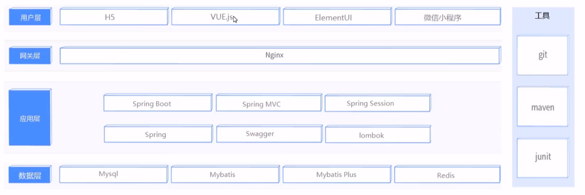
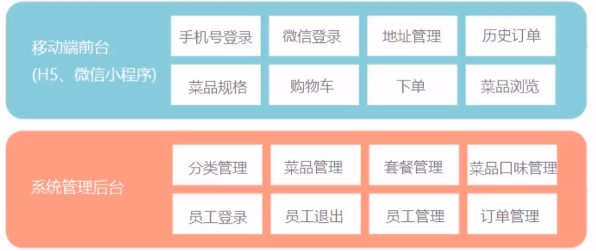

# 项目介绍

项目分为三部分：

（1）实现基本功能，移动端应用通过H5实现，用户可以通过手机浏览器访问；

（2）针对移动端进行改进，使用微信小程序，使得使用更方便；

（3）针对系统进行优化，提高访问性能。


**技术选型**




**功能架构**




# 技术

### 知识点

**项目结构**

src/main/java目录用于存放项目的java源代码；

src/main/resources用于存放项目使用的资源，其子目录包括static（用于存放html/css/js等静态资源）和template（用于存放一些模板引擎，如jsp、Freemark）以及springboot的相关配置文件（.properties、.yml）

src/test/java目录用于存放当前项目的测试代码；

src/pom.xml用于存放jar包的坐标，用于项目依赖的配置。


##### **在resources下的静态资源无法直接访问怎么处理？**

（1）添加映射配置

```java
//静态资源访问配置
@Configuration
public class WebMvcConfig extends WebMvcConfigurationSupport {
    @Override
    protected void addResourceHandlers(ResourceHandlerRegistry registry) {
        //当我们访问的路径中带有/pages/** 会映射到类路径下的(也就是resources下) /pages/
        registry.addResourceHandler("/pages/**").addResourceLocations("classpath:/pages/");
        }
```

（2）将静态资源放在resources/static包下


##### **查找id发生不一致情况？**

JS在处理Long类型数据时，只能保留16位精度，而雪花算法生成的id有19位。

此时需要将id转为String类型。

实现：

（1）创建对象转换器（基于JSON将java对象转换为json【序列化】或将json转换为java对象【反序列化】）

在转换java对象时，用String替换Long/Bigint以及日期的表达

```java
public class JacksonObjectMapper extends ObjectMapper {

    public static final String DEFAULT_DATE_FORMAT = "yyyy-MM-dd";
    public static final String DEFAULT_DATE_TIME_FORMAT = "yyyy-MM-dd HH:mm:ss";
    public static final String DEFAULT_TIME_FORMAT = "HH:mm:ss";

    public JacksonObjectMapper() {
        super();
        //收到未知属性时不报异常
        this.configure(FAIL_ON_UNKNOWN_PROPERTIES, false);

        //反序列化时，属性不存在的兼容处理
        this.getDeserializationConfig().withoutFeatures(DeserializationFeature.FAIL_ON_UNKNOWN_PROPERTIES);


        SimpleModule simpleModule = new SimpleModule()
                .addDeserializer(LocalDateTime.class, new LocalDateTimeDeserializer(DateTimeFormatter.ofPattern(DEFAULT_DATE_TIME_FORMAT)))
                .addDeserializer(LocalDate.class, new LocalDateDeserializer(DateTimeFormatter.ofPattern(DEFAULT_DATE_FORMAT)))
                .addDeserializer(LocalTime.class, new LocalTimeDeserializer(DateTimeFormatter.ofPattern(DEFAULT_TIME_FORMAT)))

                .addSerializer(BigInteger.class, ToStringSerializer.instance)
                .addSerializer(Long.class, ToStringSerializer.instance)
                .addSerializer(LocalDateTime.class, new LocalDateTimeSerializer(DateTimeFormatter.ofPattern(DEFAULT_DATE_TIME_FORMAT)))
                .addSerializer(LocalDate.class, new LocalDateSerializer(DateTimeFormatter.ofPattern(DEFAULT_DATE_FORMAT)))
                .addSerializer(LocalTime.class, new LocalTimeSerializer(DateTimeFormatter.ofPattern(DEFAULT_TIME_FORMAT)));

        //注册功能模块 例如，可以添加自定义序列化器和反序列化器
        this.registerModule(simpleModule);
    }
}
```

（2）将该转换器添加到mvc的消息转换器中，在springboot启动前，会将设置的转换器加载到convertor的0号索引中优先执行，用于转换java对象=》json。

```java
@Slf4j
@Configuration
public class WebMvcConfig extends WebMvcConfigurationSupport {
    /**
     * 扩展mvc框架的消息转换器
     * @param converters
     */
    @Override
    protected void extendMessageConverters(List<HttpMessageConverter<?>> converters) {
        //创建消息转换器对象（将controller的返回结果，转换为相应的json）
        MappingJackson2HttpMessageConverter messageConverter = new MappingJackson2HttpMessageConverter();
        //设置对象转换器，底层使用Jackson将java对象转换为json
        messageConverter.setObjectMapper(new JacksonObjectMapper());
        //将消息转换器对象追加到mvc框架的转换器中(0，表示将该转换器作为index=0优先使用)
        converters.add(0,messageConverter);
    }
}
```


##### **如何实现自动填充？自动填充中如何获取session对象？**

（1）实现自动填充我们需要以下步骤：

* 为需要自动填充的字段添加`@TableField(fill=FieldFill.xxx)`注解

* 自定义元数据对象处理器，该类继承MetaObjectHandler，重写insertFill和updateFill方法。


（2）在自动填充中获取session对象，也就是需要在自定义的MetaObjectHandler中获取当前的session。

我们首先需要确定一次新增或修改请求中各个方法的调用顺序：

1. 先执行拦截器LoginCheckFilter，确定当前的请求是否允许访问；
2. 再执行Controller中的新增或是修改方法；
3. 通过MetaObjectHandler类实现自动填充字段的自动填充。

以上的三个步骤都在**一个线程**内执行，这是因为对于客户端而言，每次发出的HTTP请求，在服务器端都有一个对应的线程进行处理。

实现：使用ThreadLocal。ThreadLocal是Thread的局部变量，为每个使用该变量的线程提供独立的变量副本，每个线程都可以独立的改变自己的副本。

常用方法：

* `void set(T value)`     设置当前线程的线程局部变量
* `T get() `   返回当前线程所对应的线程局部变量

步骤：

1. 编写BaseContext工具类，基于ThreadLocal封装的工具类

   ```java
   public class BaseContext {
       private static ThreadLocal<Long> threadLocal = new ThreadLocal<>();
   
       public static void setCurrentId(Long id){
           threadLocal.set(id);
       }
   
       public static Long getCurrentId(){
           return threadLocal.get();
       }
   }
   ```

2. 在拦截器中调用BaseContext设置id存入ThreadLocal局部变量；

   ```java
   if(request.getSession().getAttribute("employee")!=null){
       log.info("用户已登陆，用户id为:{}",request.getSession().getAttribute("employee"));
       //登陆状态下，将当前用户的id设置到当前线程的ThreadLocal中
       Long empId = (Long)request.getSession().getAttribute("employee");
       BaseContext.setCurrentId(empId);
   
       filterChain.doFilter(request,response);
       return;
   }
   ```

3. 在元对象处理器中获取该局部变量；

   ```java
   metaObject.setValue("createUser", BaseContext.getCurrentId());
   metaObject.setValue("updateUser", BaseContext.getCurrentId());
   ```

##### **如何实现上传下载？**

（1）上传时，对页面的form表单有以下要求：

* 表单需要有两个属性：method=“post”  enctype=“multipart/form-data”

* 对表单中的每个文件资源，要求 type=“file”

服务器如何接收客户端上传的文件，通常使用Apache的两个组件：

* commons-fileupload
* commons-io

在Spring项目中，spring-web对其进行了封装，我们在Controller方法的参数中声明MultipartFile类型参数即可接受上传的文件。

注意点：

* 形参的对象名称必须与

* 需要转存到指定的位置，否则客户端只会把该文件存放在临时目录中。


（2）下载时，我们有附件形式下载以及浏览器打开两种方式。

浏览器进行文件下载，本质上是服务器将文件以流的形式回写给浏览器的过程。